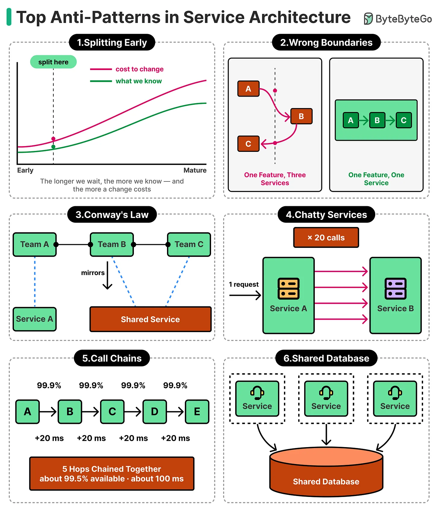

# Microservices

The architectural style of organizing applications as independent, single-business-capability services — plus the operational complexity that trips most teams up when they adopt it prematurely.

## Key Takeaways

- **Microservices are about ownership and independence, not size.** Each service owns a single business capability, runs in its own process, communicates over HTTP/messaging, and deploys independently
- The most common mistake: **adopting too early**. Microservices replace code complexity with operational complexity. Without robust automation/observability/monitoring, you've made things worse
- **Build a modular monolith first**, extract services only when the pain of the monolith genuinely outweighs the cost of distributed systems
- Microservices shine when you have: uneven traffic patterns (scale parts), independent team deploys, clear domain boundaries, distributed ownership (large org), resilience demands (partial failure OK)
- A well-structured monolith outperforms premature microservice extraction in nearly every dimension that matters early — speed of development, debuggability, deployment simplicity
- **Top 6 anti-patterns:** splitting early, wrong boundaries, Conway's Law misalignment, chatty services, deep call chains (5 hops → 99.5% availability, +100ms), shared database

## What Microservices Actually Are

The defining traits:

| Trait | What it means |
|---|---|
| **Independent processes** | Each service runs separately; can be in different languages |
| **Single business capability** | One service owns one bounded context (orders, payments, inventory) |
| **Independent deployment** | Deploy one service without coordinating with others |
| **Network communication** | HTTP/gRPC/messaging between services, not function calls |
| **Independent data** | Each service owns its own data; no shared schemas |

It is NOT about service size. "Micro" is misleading — services can be reasonably large. What matters is the *independence* properties.

## When Microservices Help

| Driver | Why it pushes you toward microservices |
|---|---|
| **Uneven traffic** | Scale the hot service independently rather than the whole app |
| **Team-level deploys** | Many teams blocking on one monolithic deploy is friction; service-per-team unblocks |
| **Clear domain boundaries** | When domains are well-understood, extraction is cheap. Bad boundaries are expensive |
| **Distributed ownership** | Large orgs can't have everyone in one repo; service-per-team aligns with Conway |
| **Resilience requirements** | Partial failure (one service down, rest works) beats total outage |

If none of these apply, **stay with the monolith.**

## The Three Most Common Mistakes

### 1. Adopting Too Early
The biggest pitfall. Early-stage products have:
- Shifting domain boundaries (microservices boundaries calcify them — costly to redraw)
- Small teams (operational overhead per service is high)
- Unclear performance characteristics (you don't know which service needs to scale)
- High iteration velocity (cross-service refactors are expensive)

Premature microservices add complexity without solving anything.

### 2. Insufficient Operations Maturity
A microservice architecture needs:
- Automated deployment per service (or you'll never ship anything)
- Distributed tracing (or you can't debug)
- Service discovery and load balancing
- Centralized logging
- Health checks and circuit breakers
- Per-service monitoring with SLOs

Without these, failures are "invisible and painful." A small team typically can't sustain this overhead.

### 3. Over-Engineering Simple Problems
A `users` service, an `auth` service, a `profile` service, a `notifications` service — when all four are CRUD on adjacent tables, you've made distributed transactions, eventual consistency, and network failures your problem when a `BEGIN; ...; COMMIT;` would have worked fine.

## Top 6 Service Architecture Anti-Patterns

### 1. Splitting Early
The longer you wait to split, the more you know about the domain — but the higher the cost to change. Split too early and you calcify wrong boundaries; the cost to redraw them later grows with every integration built on top.

### 2. Wrong Boundaries
A bad split puts a single feature across multiple services. If completing one user action requires coordinating A → B → C, those three services have the wrong boundaries — they should be one. The test: can one team ship one feature touching only one service?

### 3. Conway's Law (Unintentional)
System architecture mirrors team communication structure. When two teams share a service (or a team spans multiple services), the service boundaries will reflect the org chart, not the domain. Design teams and services together; a shared service owned by no single team becomes a bottleneck.

### 4. Chatty Services
One external request fans out into 20 service-to-service calls. Each call adds network latency, a failure surface, and retry logic. Fix by coarsening the API (batch operations, returning richer payloads), using async messaging, or merging over-split services.

### 5. Call Chains
Synchronous chaining multiplies both latency and availability loss:
- 5 hops × 20ms each = **100ms added latency** minimum
- 5 hops × 99.9% availability = **99.5% composite availability** (five 9s → two 9s)

Avoid deep sync chains. Use async/event-driven patterns for non-critical paths; keep sync chains ≤ 2–3 hops.

### 6. Shared Database
Multiple services reading and writing the same database breaks service independence: schema changes become cross-team coordination events, one service's query load starves others, and transactions span service boundaries. Each service must own its data store exclusively.

## The Operational Tax

Microservices replace:
- Code complexity (one big codebase) → operational complexity (many small ones)

With distributed systems come:
- **Network latency** — every previously-in-process call is now a network hop
- **Partial failures** — services can fail independently; the calling service has to handle this
- **Eventual consistency** — what was a transaction is now a saga ([distributed-transactions.md](distributed-transactions.md))
- **Distributed tracing** — debugging a single user request requires correlating across many services
- **Schema evolution as contract** — each service's API is now a public interface to other teams
- **Operational overhead** — deploy pipelines, monitoring dashboards, on-call rotations per service

For many problems, this tax is worth it. For early-stage products, it's destructive.

## The Modular Monolith — The Honest Default

Most articles oversell microservices. The realistic default for most teams:

1. **Build a modular monolith** — one deployable unit, but organized into modules with clear boundaries
2. **Enforce module boundaries** with code review or build-time checks (no module reaches into another's internals)
3. **Use sync internal calls** (function calls within the process) — fast, easy to debug
4. **Extract services only when you hit specific pain** — a module needs to scale independently, a team needs independent deploys, a domain genuinely diverges

This sequencing gets you 80% of the team-velocity benefits without 80% of the operational overhead. The modules can later become services if they need to.

## Generalizable Lessons

1. **Ownership and independence matter more than size.** Don't optimize for "small services"; optimize for "services with clear ownership and minimal coupling"
2. **Distributed systems are hard.** Every microservice adopt makes you a distributed-systems team whether you want to or not
3. **Operations is the gating factor.** If you can't operate the system, the architecture doesn't matter
4. **Boundaries are expensive to change.** Get the domain boundaries right (or stay flexible with a monolith) before solidifying them in service contracts
5. **The modular monolith is underrated.** Most "we need microservices" cases are really "we need better module boundaries"

## Related

- [Cross-cutting concerns](cross-cutting-concerns.md) — externalized config, service discovery, circuit breakers, deployment patterns
- [Service discovery](service-discovery.md) — how services find each other at runtime
- [Service mesh and sidecar](service-mesh-and-sidecar.md) — mTLS + observability for microservices at scale
- [Distributed transactions](distributed-transactions.md) — Saga pattern for cross-service transactions
- [Event-driven systems](event-driven.md) — async communication between services
- [Distributed system failure modes](distributed-system-failure-modes.md) — the failure modes microservices expose you to
- [Forward/reverse proxy and API gateway](forward-reverse-proxy-and-api-gateway.md) — the front door for microservice deployments
- [Microservices architectures (Wise case study)](case-studies/wise-tech-stack.md) — production microservices done well

---

**Source:** https://blog.levelupcoding.com/p/microservices-clearly-explained
**Source:** Imported from pasted notes (ByteByteGo anti-patterns infographic)
**Date:** 2026-06-05
**Tags:** microservices, architecture, modular-monolith, distributed-systems, ownership, conway, anti-patterns, when-to-adopt, chatty-services, call-chains, shared-database, wrong-boundaries
