# Mobile System Design

## Key Takeaways

- Mobile apps face unique constraints -- unstable networks, limited storage, battery drain, and OS-imposed background restrictions -- that demand different design tradeoffs than server-side systems
- An offline-first architecture (local reads/writes first, background sync to server) provides the best UX but adds significant complexity around conflict resolution and data consistency
- Choose communication patterns based on your use case: REST for simplicity, GraphQL for precise data fetching, gRPC for high-performance, WebSockets for real-time bidirectional, and push notifications for background delivery
- Delta sync, request batching, and cursor-based pagination are essential techniques for minimizing bandwidth and battery consumption on mobile
- Optimistic UI updates with rollback capability give users instant feedback while handling the reality of unreliable network conditions

## Networking and Communication

### Client-Server Architecture: Thick vs Thin Clients

The fundamental decision in mobile design is how much logic lives on the device versus the server.

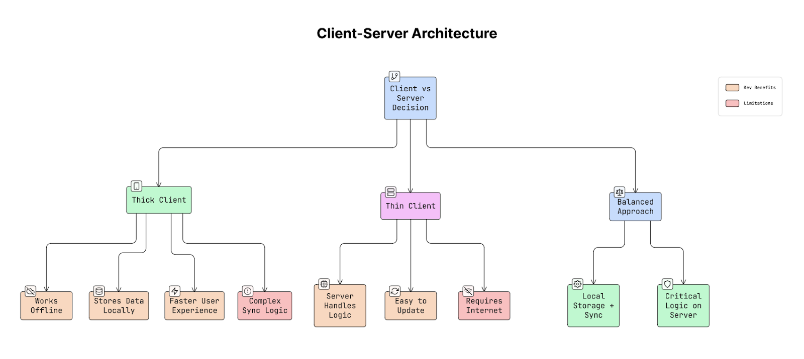

- **Thick client**: processes data locally, enables offline work, stores data on device. Tradeoff: complex sync logic
- **Thin client**: server handles all processing, easy to update. Tradeoff: requires constant internet connectivity
- **Best practice**: keep main logic thick for responsiveness, but keep sensitive operations (payments, auth) on the server

### WebSockets and Persistent Connections

WebSockets enable bidirectional real-time communication over a single persistent TCP connection. Essential for chat apps, live scores, multiplayer games, and collaborative editing.

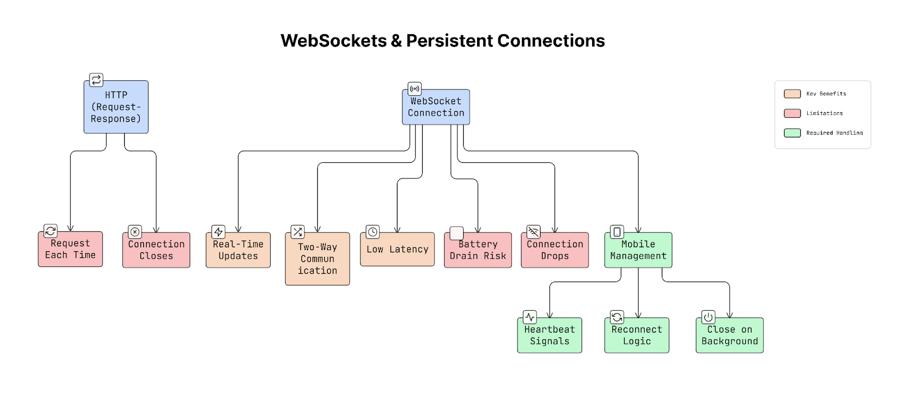

Mobile-specific challenges:
- Battery drain from maintaining persistent connections
- OS backgrounding can kill connections
- Need reconnection logic with exponential backoff

### Push Notifications (APNs and FCM)

Push notifications deliver updates when the app is closed or backgrounded, using Apple Push Notification Service (iOS) and Firebase Cloud Messaging (Android).

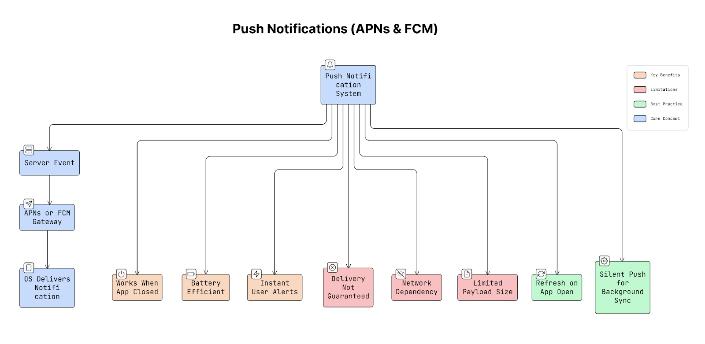

Important: push delivery is not 100% guaranteed. Always verify data freshness when the app opens.

### Polling, Long Polling, and SSE

Three alternatives to WebSockets for server-to-client updates:

- **Short polling**: client repeatedly asks server for updates at intervals. Simple but wasteful -- most responses are empty
- **Long polling**: server holds the request open until new data is available, then responds. Reduces empty responses but still uses HTTP overhead
- **Server-Sent Events (SSE)**: efficient one-way streaming from server to client over HTTP. Good for live feeds and dashboards where the client only needs to receive

### REST vs GraphQL vs gRPC

| Protocol | Strengths | Weaknesses | Best For |
|----------|-----------|------------|----------|
| REST | Simple, widely supported, cacheable | Over/under-fetching | CRUD APIs, simple resources |
| GraphQL | Client specifies exact data needed | Harder to cache and secure | Complex UIs needing flexible queries |
| gRPC | Binary protocol, HTTP/2, high performance | Specialized tooling, no browser support | Microservice-to-microservice, streaming |

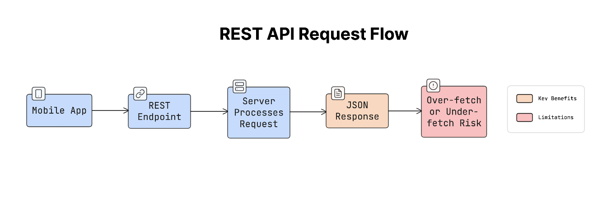

### Network Resilience: Exponential Backoff and Retry

When requests fail, naive retry loops can overwhelm servers (thundering herd problem). Exponential backoff with jitter spreads retry attempts over time.

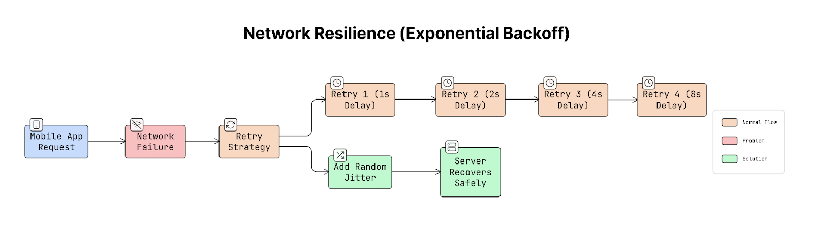

- Double the wait time after each failure (1s, 2s, 4s, 8s...)
- Add random jitter to prevent synchronized retries across clients
- Set a maximum retry count or timeout

### Idempotency in APIs

Use unique idempotency keys (UUIDs) attached to each state-changing request. If the client retries, the server recognizes the duplicate key and returns the cached response instead of reprocessing. Critical for payment flows and any operation where duplicates cause real harm.

### Request Batching and Payload Optimization

Combine multiple API calls into a single request to reduce network radio wake-ups (each wake-up drains battery). Additional optimizations:

- Use compression (gzip, Brotli) for responses
- Send only required fields
- Minimize payload size with efficient serialization

### Resumable Uploads (Chunked Uploads)

For large file uploads (video, media), split files into smaller chunks and track progress. If the connection drops, resume from the last successful chunk instead of restarting. Essential for reliable media uploads on mobile networks.

### Handling Intermittent Connectivity

- **Local request queuing**: store actions offline, sync when connectivity returns
- **Optimistic UI**: update the interface immediately, correct if the server rejects
- **Network state awareness**: monitor connectivity status and adapt behavior (e.g., defer non-critical syncs on poor connections)

## Caching and Offline

### On-Device Caching: Memory vs Disk

Use a two-layer caching strategy:

- **Memory cache** (L1): instant access, cleared when app closes. Good for frequently accessed data during a session
- **Disk cache** (L2): persistent across app restarts, slower than memory. Good for images, API responses, user preferences

Read from memory first, fall back to disk, then network.

### HTTP Caching (ETag, Cache-Control)

- **Cache-Control** headers specify how long a response is valid (max-age, no-cache, no-store)
- **ETags** enable conditional requests: client sends the ETag, server returns 304 Not Modified if nothing changed
- Saves bandwidth on repeated requests to the same endpoints

### Offline-First Architecture

The gold standard for mobile UX. The app reads and writes to local storage first, and background sync pushes changes to the server asynchronously.

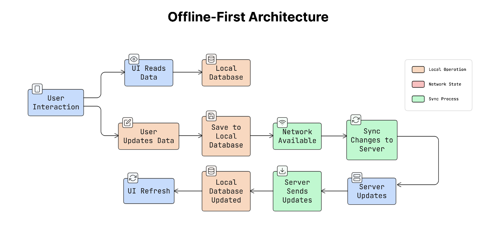

Benefits: instant responsiveness, works without connectivity. Tradeoffs: requires conflict resolution, eventual consistency, and careful sync logic.

### CDN Strategy and Media Optimization

- Serve static content from geographically closest CDN edge servers
- Resize images to match device dimensions (don't send 4K images to a phone)
- Use modern formats: WebP and AVIF reduce file sizes 25-50% vs JPEG/PNG
- Implement lazy loading to avoid downloading off-screen content

### Cache Invalidation Strategies

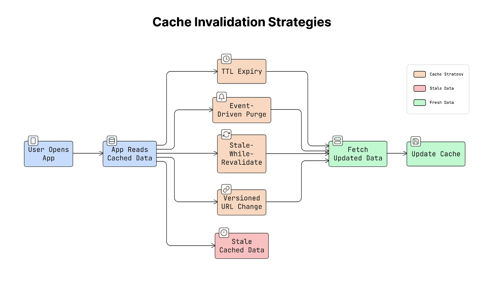

| Strategy | How It Works | Best For |
|----------|-------------|----------|
| TTL-based | Expire after a set time | Content that changes predictably |
| Event-driven | Server notifies client of changes | Real-time critical data |
| Stale-while-revalidate | Show cached data, refresh in background | Feeds, dashboards |
| Versioned URLs | New URL when content changes | Static assets (JS, CSS, images) |

## Data Synchronization

### Conflict Resolution Strategies

When multiple devices edit the same data simultaneously, three approaches handle conflicts:

- **Last-Write-Wins (LWW)**: keeps the most recent timestamped update. Simple but risks silent data loss
- **Versioning**: tracks version numbers, enables intelligent merging or prompts the user to choose. More reliable but adds complexity
- **CRDTs (Conflict-free Replicated Data Types)**: mathematical structures that automatically merge without conflicts. Used by Figma and Notion for collaborative editing

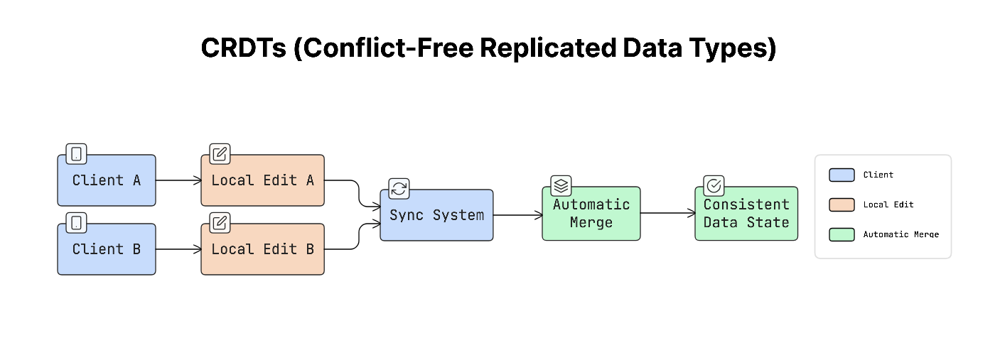

### Delta Sync

Instead of downloading the full dataset on every sync, transfer only what changed since the last sync token. The process:

1. Initial full download -- server issues a sync token
2. Subsequent syncs send the token -- server returns only new, updated, and deleted records
3. Client applies changes and stores the new token

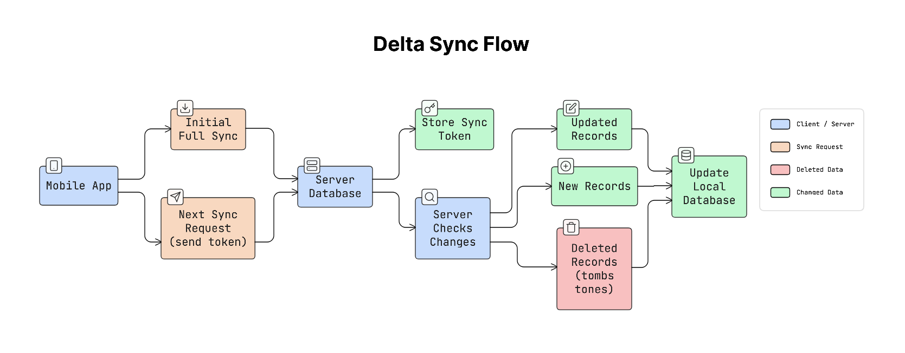

Used by Google Contacts, Apple CloudKit, and most modern sync-capable APIs. Dramatically reduces bandwidth and battery consumption.

### Eventual Consistency

Data temporarily differs across devices but converges after synchronization completes. This is the practical tradeoff for offline-capable apps: you accept temporary inconsistency in exchange for responsiveness and offline operation.

### Background Sync and Retry Queues

Failed operations are stored locally in a retry queue and retried when connectivity returns. Platform-specific tools:

- **Android**: WorkManager for battery-efficient background processing
- **iOS**: BGTaskScheduler for scheduled background tasks

Both respect OS constraints on background execution to preserve battery life.

### Optimistic UI Updates

Update the UI immediately when the user takes an action, then confirm with the server asynchronously. If the server rejects the change, roll back the UI and show an error.

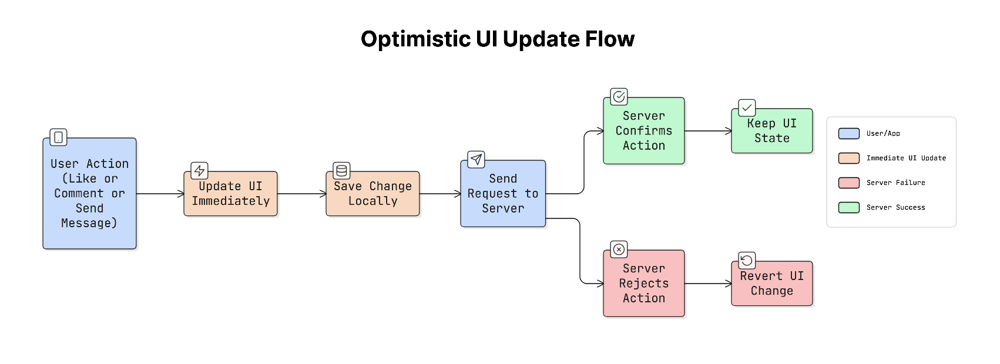

Used by WhatsApp (message sent indicator), Gmail (undo send), Twitter/Instagram (instant likes), and Slack (immediate message display).

## Storage and Data

### Local Database Design

Prefer **denormalized schemas** on mobile: store related data together in fewer tables. This differs from server-side best practices because:

- Mobile reads must be fast to avoid janky UI
- Complex JOIN queries are expensive on mobile CPUs
- Denormalization trades storage space (cheap) for read speed (critical)

Always index columns used in WHERE clauses and ORDER BY to prevent slow renders.

### Schema Migration Strategy

When your local database schema changes between app versions:

- **Additive migrations** (add columns, tables): preserve existing data, preferred approach
- **Destructive migrations** (restructure tables): simpler code but loses cached data
- Migrations must be sequential (v1 -> v2 -> v3) -- users may skip app versions
- When in doubt, reset and re-download from server rather than risk crashes from failed migrations

### Pagination

| Type | Mechanism | Best For | Pitfall |
|------|-----------|----------|---------|
| Page number | `?page=3` | Static search results | Breaks if data changes between pages |
| Offset | `?offset=20&limit=10` | Simple lists | Duplicates/skips when items are added/removed |
| Cursor-based | `?after=cursor_token` | Live feeds, timelines | More complex to implement |

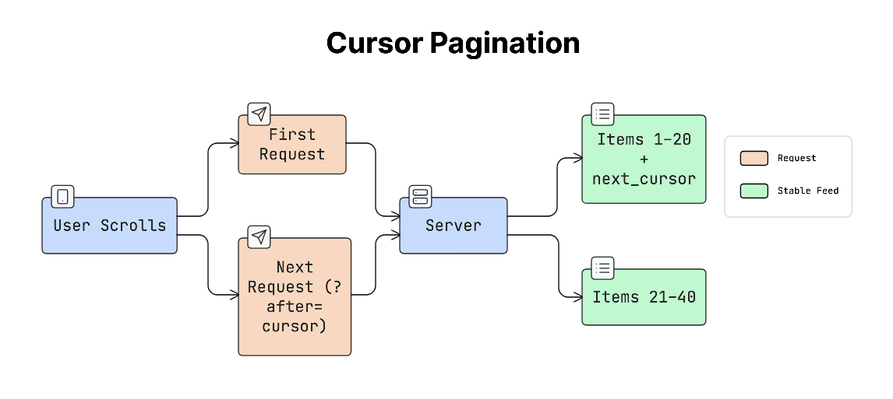

Cursor-based pagination is the recommended approach for dynamic content (social feeds, chat history) because it handles insertions and deletions without skipping or duplicating items.

### Data Modeling for Mobile Constraints

- **Limited storage**: auto-delete old or unused data; implement LRU eviction
- **Battery awareness**: minimize database writes, batch when possible
- **Pre-compute**: calculate frequently needed values at write time to avoid expensive reads
- **Optimize for UI**: structure data around how screens display it, not around theoretical purity

## Design Tradeoffs Summary

| Concept | Benefit | Tradeoff |
|---------|---------|----------|
| Thick client | Offline support, fast UX | Complex sync logic |
| Thin client | Easy updates, simple client | Requires connectivity |
| Offline-first | Best UX, works anywhere | Conflict resolution complexity |
| Optimistic UI | Instant feedback | Rollback complexity |
| Delta sync | Bandwidth efficiency | Server must track changes |
| CRDTs | Automatic conflict-free merging | Implementation complexity |
| LWW | Simple implementation | Silent data loss risk |
| Denormalized DB | Fast reads | Data duplication, larger storage |

---

## Interview Framework (~45 min)

For mobile system design interviews, a reusable four-phase structure:

| Phase | Time | Focus |
|---|---|---|
| **1. Requirements & Scope** | 5-10 min | Clarify what's being designed |
| **2. API & Data Needs** | 5-10 min | Define client-server interactions |
| **3. Architecture** | 10-15 min | Components and data flow |
| **4. Deep Dive** | 15-20 min | Critical flows or new constraints |

### Step 1 in detail

The most underrated step. Before drawing anything, surface:

**Briefing questions:**
- Success criteria and priorities
- Platform scope (iOS/Android/both) and target devices
- Network conditions (offline support needed?)
- User base size and constraints
- What hidden requirements are likely?

> "Your first job is not to design anything. It's understanding what you're being asked to design."

### Mobile-specific deep-dive topics

For phase 4, prioritize the topics covered in the rest of this note:
- Caching strategy
- App lifecycle handling (foreground/background/killed)
- Memory and battery constraints
- Offline-first capabilities + sync conflict resolution
- Background task management (iOS BGTask, Android WorkManager)

### Seniority signal

Juniors show competence by **asking** clarifying questions. Seniors **proactively uncover hidden requirements** — they spot the constraint the interviewer didn't mention.

See also [system-design-interview-approach.md](../leadership/system-design-interview-approach.md) for the broader (non-mobile) interview framework.

---

**Source:** https://newsletter.systemdesign.one/p/mobile-system-design
**Source:** https://newsletter.systemdesign.one/p/mobile-system-design-concepts
**Source:** https://newsletter.systemdesign.one/p/mobile-system-design-interview
**Date:** 2026-05-31 (initial), 2026-06-05 (added interview framework)
**Tags:** mobile, system-design, offline-first, caching, synchronization, networking, pagination, interview-framework
