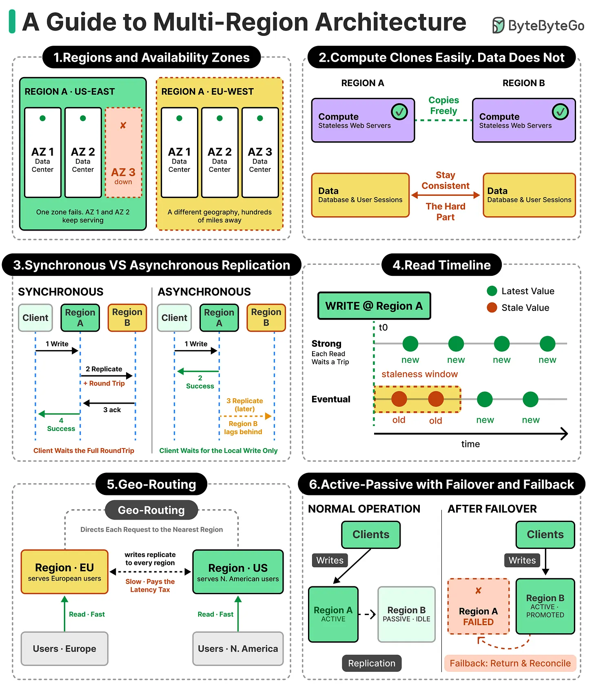

# Multi-Region Architecture

## Key Takeaways
- Compute scales easily across regions; data does not — replication introduces a new class of consistency problems the moment the same data lives in two places at once
- The progression: single region with backups → multiple active regions → fully distributed global deployment, each step adding latency benefits and consistency tradeoffs
- When simultaneous edits occur across regions during a network partition, each region holds a different data version with no shared record of which came first — this is the core tension
- Multi-region deployments pay off on: reduced latency (serve users from nearby region), improved availability (survive regional failure), and data residency compliance
- Active-passive is simpler to operate; active-active maximizes availability but requires conflict resolution strategy

## Key Concepts (from cheat sheet)

**1. Regions and Availability Zones**
A region is a geographic area (e.g., US-East, EU-West). Each region contains multiple Availability Zones (AZs) — physically separate data centers within the same region. One AZ failing does not take down the region; one region failing is survived by other regions.

**2. Compute Clones Easily, Data Does Not**
Stateless compute (web servers) can be cloned freely across regions — they hold no state. Databases and sessions cannot: copies must stay consistent, which requires explicit replication and conflict handling.

**3. Synchronous vs Asynchronous Replication**
- **Synchronous:** client waits for the write to succeed in all replica regions before getting a response. Strong consistency, but adds full round-trip latency per write.
- **Asynchronous:** client waits only for the local write; replication happens in the background. Fast writes, but replicas may serve stale data during the replication lag window (the "staleness window").

**4. Read Timeline: Strong vs Eventual Consistency**
- **Strong consistency:** every read sees the latest write. Requires coordination across regions.
- **Eventual consistency:** reads may return stale values during the staleness window after a write; eventually all replicas converge. Faster, but applications must tolerate stale reads.

**5. Geo-Routing**
Routes each request to the nearest region. Fast for reads; writes to a remote primary still pay the cross-region latency. Common pattern: read from nearest region, write to primary region.

**6. Active-Passive with Failover and Fallback**
- **Normal operation:** one region is active (serves writes), another is passive/idle (receives replicated data).
- **Failover:** when the active region fails, traffic shifts to the passive region. The passive region becomes active.
- **Fallback:** when the original active region recovers, traffic is returned and data is reconciled.

---

> **Note:** Full article content is behind a paywall. Stub created from article intro and cheat sheet image. Expand with detailed decision frameworks and implementation patterns when full content is available.

---

**Source:** https://blog.bytebytego.com/p/multi-region-architecture-going-global
**Date:** 2026-07-02
**Tags:** system-design, multi-region, distributed-systems, replication, consistency, geo-routing, active-passive, active-active, availability-zones, data-residency, failover
