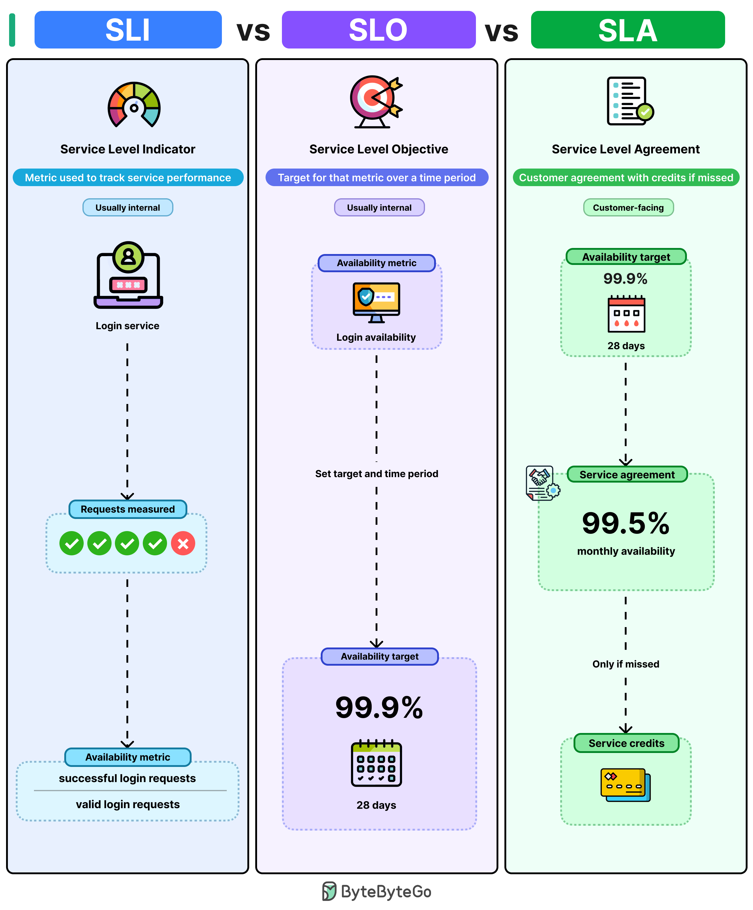

# SLA vs SLO vs SLI

## Key Takeaways

- **SLI** is the raw metric (e.g., ratio of successful requests to total requests) -- it tells you what is actually happening right now
- **SLO** is an internal target set around an SLI over a time window (e.g., 99.9% availability over 28 days) -- it acts as an early-warning threshold
- **SLA** is the contractual promise to customers, typically set lower than the SLO (e.g., 99.5% monthly) -- breaching it triggers service credits or penalties
- Always keep an SLO stricter than the SLA so teams catch degradation before it becomes a contractual breach
- If your SLO equals your SLA (both 99.9%), you have zero buffer -- any dip immediately violates the customer agreement

## How They Relate



The three concepts form a layered reliability framework, moving from measurement to internal target to external contract:

```
SLI (measurement) --> SLO (internal target) --> SLA (external contract)
```

### SLI -- Service Level Indicator

The actual metric being measured. For a login service, this might be:

> Ratio of successful login requests to total valid login requests

SLIs are **usually internal** and represent raw observability data. Common SLIs include availability, latency percentiles (p50, p99), throughput, and error rate.

### SLO -- Service Level Objective

A target set around an SLI for a specific time period. Example:

> Login availability should stay above **99.9%** over a rolling **28-day** window

SLOs are also **usually internal**. When an SLO is missed, it signals engineering teams to investigate before customers are affected. The gap between an SLO and an SLA is your **error budget** -- the amount of allowed unreliability before contractual consequences kick in.

### SLA -- Service Level Agreement

A **customer-facing** contractual commitment, typically set with more headroom than the SLO. Example:

> **99.5%** monthly availability; breaches trigger service credits

SLAs are only triggered when the metric drops below the agreed threshold. They carry financial or contractual consequences.

## Practical Guidance

| Aspect | SLI | SLO | SLA |
|--------|-----|-----|-----|
| Audience | Engineering | Engineering / Product | Customers |
| Nature | Measurement | Target | Contract |
| Example | 99.95% success rate | >= 99.9% over 28 days | >= 99.5% monthly |
| Consequence of miss | Dashboard alert | Incident investigation | Service credits / penalties |

### Setting SLOs for a New Service

- Start by measuring SLIs in production for a few weeks to understand baseline performance
- Set an SLO slightly below the observed baseline -- not aspirational, but realistic
- Ensure a meaningful gap between SLO and SLA to create a usable error budget
- Revisit SLOs quarterly as the service matures and usage patterns become clearer

---

**Source:** https://blog.bytebytego.com/i/195380781/sla-vs-slo-vs-sli
**Date:** 2026-05-31
**Tags:** observability, reliability, SLA, SLO, SLI, service-level
