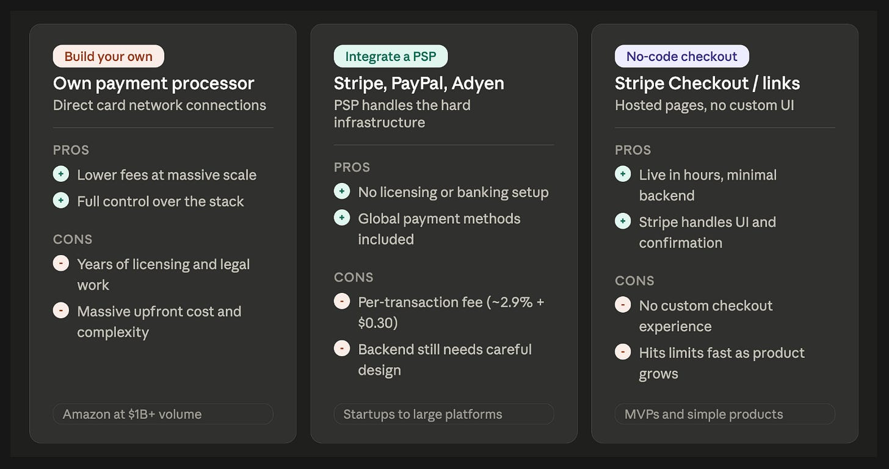
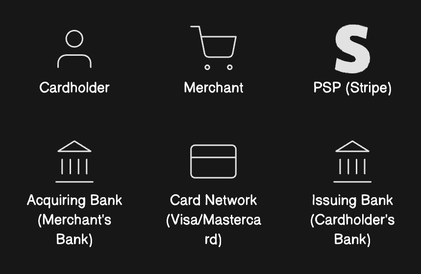
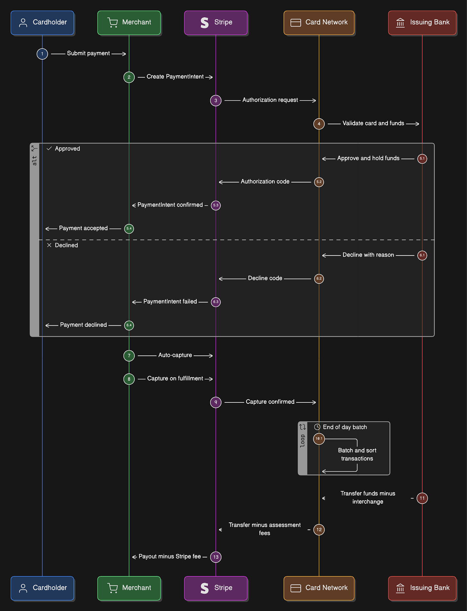
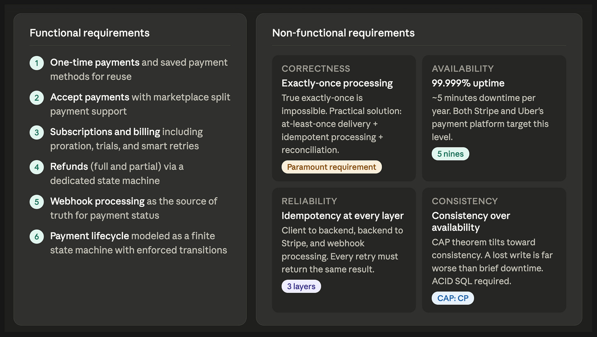
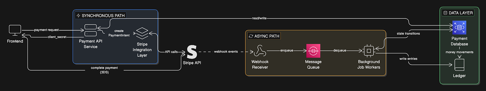

# Payment Systems

Designing a payment backend is unlike most systems: **correctness under failure matters more than performance**. The defining question for every component is "what happens if this fails mid-transaction?" — not "how fast is this?"

## Key Takeaways

- Three build-vs-buy options: own processor (Amazon-scale only, 12–24 mo licensing), PSP integration (Stripe/Adyen — default for most), no-code (Stripe Checkout, MVPs)
- A card payment crosses **six entities** (cardholder, merchant, PSP, acquiring bank, network, issuing bank) in three phases: **Authorization** (1–3s hold), **Capture** (immediate or delayed), **Clearing & Settlement** (T+1 to T+3)
- True exactly-once delivery is impossible (Two Generals Problem). The practical recipe is **at-least-once delivery + idempotent processing + reconciliation** — enforced at every layer
- Payment systems pick **consistency over availability** on CAP. All major platforms (Shopify, Uber, Airbnb) use SQL/ACID for core payment data — a lost write or stale read is much worse than a brief outage
- The reference architecture splits into a **synchronous path** (API + Stripe adapter) and an **async path** (webhook receiver → queue → workers), backed by a mutable `payments` table, an append-only `payment_events` log, and a **double-entry ledger**

## Three Ways to Accept Payments

| Option | Who it's for | Tradeoff |
|---|---|---|
| **Build your own processor** — direct card network connections, banking licenses, PCI DSS Level 1 | Billions in annual volume (Amazon, Uber, Airbnb for parts of their stack) | Saves ~0.5% per transaction (hundreds of millions at scale); costs millions and 12–24 months to launch |
| **PSP integration** (Stripe, PayPal, Adyen) | Startups → large platforms — Shopify still runs on Stripe at billions/year | ~2.9% + $0.30 per transaction, but no licensing, no PCI scope, global methods included |
| **No-code checkout** (Stripe Checkout, payment links) | MVPs, single-product sales, donations | Live in hours; no custom UI, limited real-time control |

## How Money Moves

The participants:

1. **Cardholder**
2. **Merchant**
3. **PSP** (Stripe)
4. **Acquiring bank** — merchant's bank
5. **Card network** — Visa, Mastercard
6. **Issuing bank** — cardholder's bank

### Phase 1: Authorization (1–3 seconds)

1. Customer enters card details in Stripe Elements (Stripe-hosted iframes — PAN never touches merchant servers)
2. Backend creates a **PaymentIntent** via Stripe API, returns `client_secret` to frontend
3. Stripe.js tokenizes the card
4. Stripe sends an **ISO 8583** authorization message to the acquiring bank
5. Acquiring bank identifies the network by **BIN** (first 6–8 digits of PAN)
6. Network routes to issuing bank, which checks validity, funds, CVV/AVS, fraud models
7. A two-digit approve/decline code flows back through the chain

**Timing:** Mastercard averages 130ms network response; full round-trip 1–3s. The result is a **hold** on the cardholder's available balance — money hasn't moved yet.

**PaymentIntent** is the stateful object tracking one payment end-to-end. States: `requires_payment_method` → `requires_action` (3D Secure / 2FA) → `processing` → `succeeded`.

### Phase 2: Capture (immediate or delayed)

Capture finalizes the authorized amount.

- **Immediate** (default `capture_method: automatic`) — digital goods, subscriptions
- **Delayed** — physical goods, hotels, ride-hailing (capture on fulfillment)

Rules:
- Capture amount ≤ authorized amount
- Holds last **5–10 days** (Visa: 10 standard, 31 for lodging)
- If capture doesn't happen in ~7 days, the issuing bank may release the hold

**Engineering risk:** `AUTHORIZED` and `CAPTURED` must be **distinct states**. You need a background job that detects payments stuck in `AUTHORIZED` past the hold window and marks them expired — otherwise you'll attempt captures that silently fail.

### Phase 3: Clearing & Settlement (T+1 to T+3)

End of business day, captured transactions get batched, the network calculates fees, and money moves issuing bank → network → acquiring bank → merchant. US standard is **T+2** for funds availability. New merchant accounts typically see a 7–14 day initial hold.

### Where the Fees Go (on a $100 US online transaction)

| Component | Amount | Goes to |
|---|---|---|
| Interchange | ~$2.05 | Issuing bank — covers risk and customer rewards |
| Assessment | ~$0.16 | Card network (Visa/Mastercard) |
| Markup | ~$0.70 | PSP (Stripe) — API, security, infrastructure |

Total ≈ $2.91, matching the 2.9% + $0.30 headline rate.

## Requirements

### Functional

- One-time payments and saved payment methods
- Merchant acceptance with marketplace split payments
- Dedicated refund state machine (full + partial)
- Subscriptions with proration, trials, **Smart Retries** for failed renewals
- Reliable Stripe webhook processing — webhooks are the source of truth
- Full lifecycle as a finite-state machine with enforced transitions

### Non-Functional

- **Exactly-once processing** — impossible in theory (Two Generals Problem), achieved in practice with at-least-once delivery + idempotent handlers + reconciliation
- **High availability** — Stripe targets 99.999% API uptime
- **Idempotency at every layer** — client→backend, backend→Stripe, webhook processing
- **Consistency over availability** — SQL/ACID for core payment data

### Scale Reference Points (mid-to-large platform)

- ~100,000 payments/day
- 500K–1M webhook events/day (5–10 per payment)
- Stripe rate limits: 100 req/s global, 25 req/s per endpoint
- Latency: <5s end-to-end (including Stripe), <100ms service-to-service

## Reference Architecture

Seven components, split across a **synchronous** path (must respond fast) and an **async** path (do the real work).

### 1. Payment API Service (sync)

Validates input, checks idempotency keys, creates/retrieves the payment record, creates a PaymentIntent, returns `client_secret` to the frontend. **Never blocks on downstream processing** — dispatches async and returns.

### 2. Stripe Integration Layer (sync)

PSP adapter that abstracts Stripe-specific logic: error mapping, idempotency-key attachment on every POST, timeout handling. Adding a second PSP touches only this layer — the "PSP adapter" pattern used by Shopify and Airbnb.

### 3. Payment Database

System of record. Two tables, both updated in the same transaction:

- **`payments`** — mutable, optimized for query (current state, idempotency keys)
- **`payment_events`** — append-only, optimized for audit, debugging, reconciliation

### 4. Webhook Receiver (sync)

Lightweight HTTP endpoint that does three things and nothing else:

1. Verify the **Stripe-Signature** header (HMAC-SHA256)
2. Store the raw event
3. Return 200 OK

Stripe's webhook timeout is ~20s, so business logic must be async. The receiver enqueues onto a message queue.

### 5. Message Queue

Kafka, SQS, or RabbitMQ. Decouples receipt from processing. Pair with the **transactional outbox pattern**: write the payment state change and an outbox row in the same DB transaction, then a separate process relays the row to the queue — no lost events on crash. Uber's payment platform runs on Kafka.

### 6. Background Job Workers

Four categories:

- **Webhook processors** — dequeue, apply state transitions idempotently
- **Retry workers** — failed PSP calls with exponential backoff
- **Reconciliation** — daily comparison of internal records vs. Stripe
- **Stuck-payment detector** — alerts on payments sitting in intermediate states past threshold

### 7. Ledger

Double-entry bookkeeping. Every money movement = balanced debit + credit pair. **Append-only** — corrections are reversing entries, never updates or deletes. Stripe's ledger logs ~5 billion money-movement events daily. Uber explicitly rebuilt their next-gen payment platform on double-entry.

## The Patterns That Keep It Correct

- **Idempotency keys** on every request — retries return the original result
- **State machine enforced at the DB** — invalid transitions reject before they corrupt state
- **Transactional outbox** — payment state change + outbox row in one transaction, relayed to queue separately
- **At-least-once + idempotent handlers** — the practical path to exactly-once semantics

---

**Source:** https://newsletter.systemdesign.one/p/design-a-payment-system
**Date:** 2026-06-11
**Tags:** payment-systems, stripe, idempotency, distributed-transactions, webhooks, ledger, state-machine, psp, double-entry-bookkeeping, exactly-once
