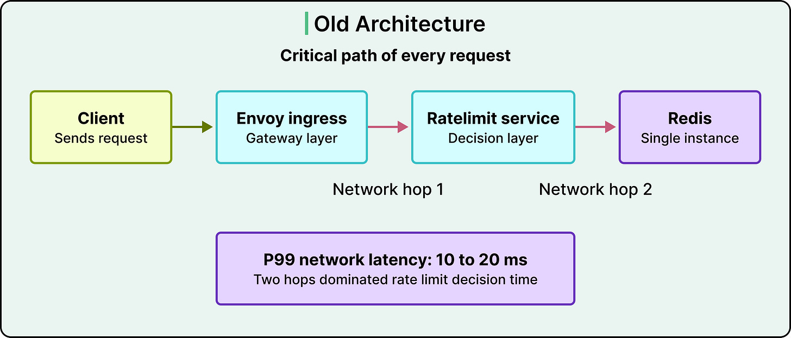
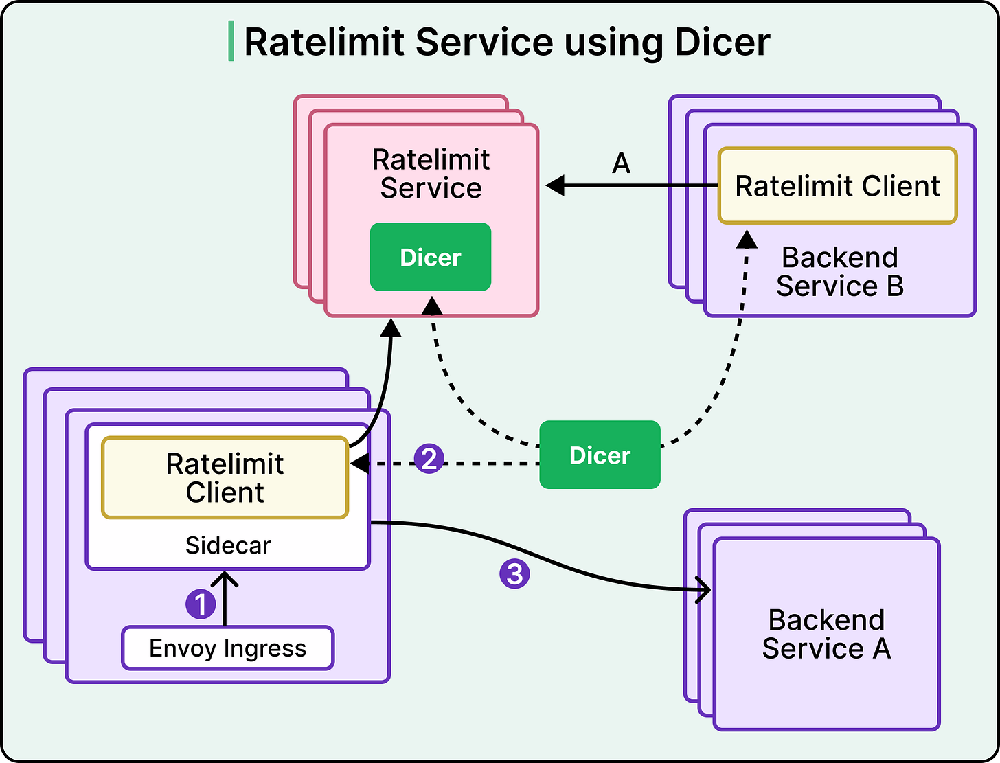
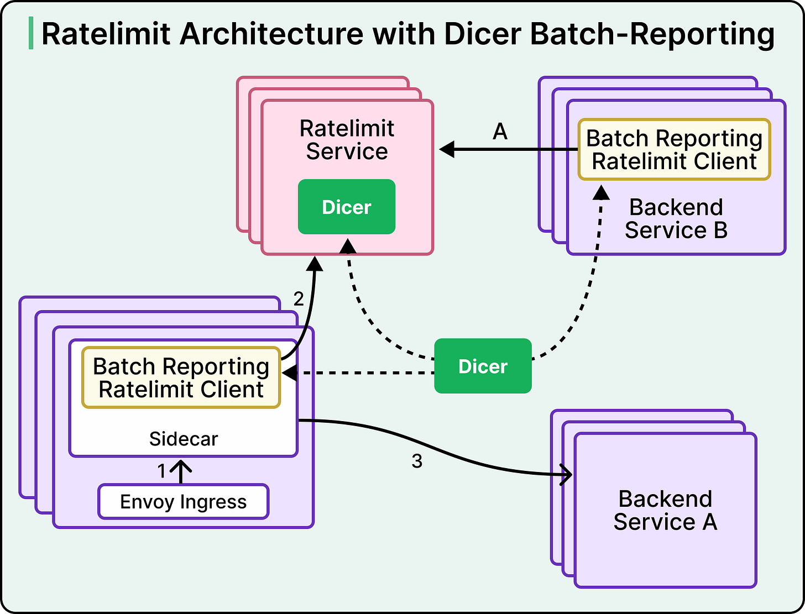
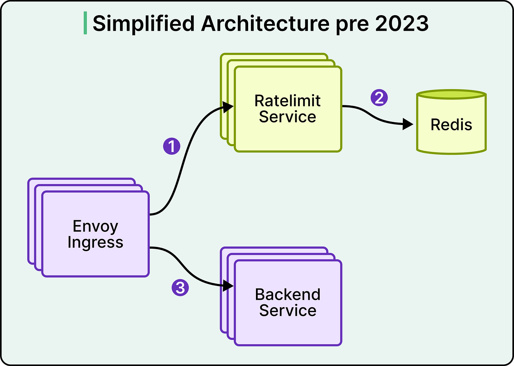
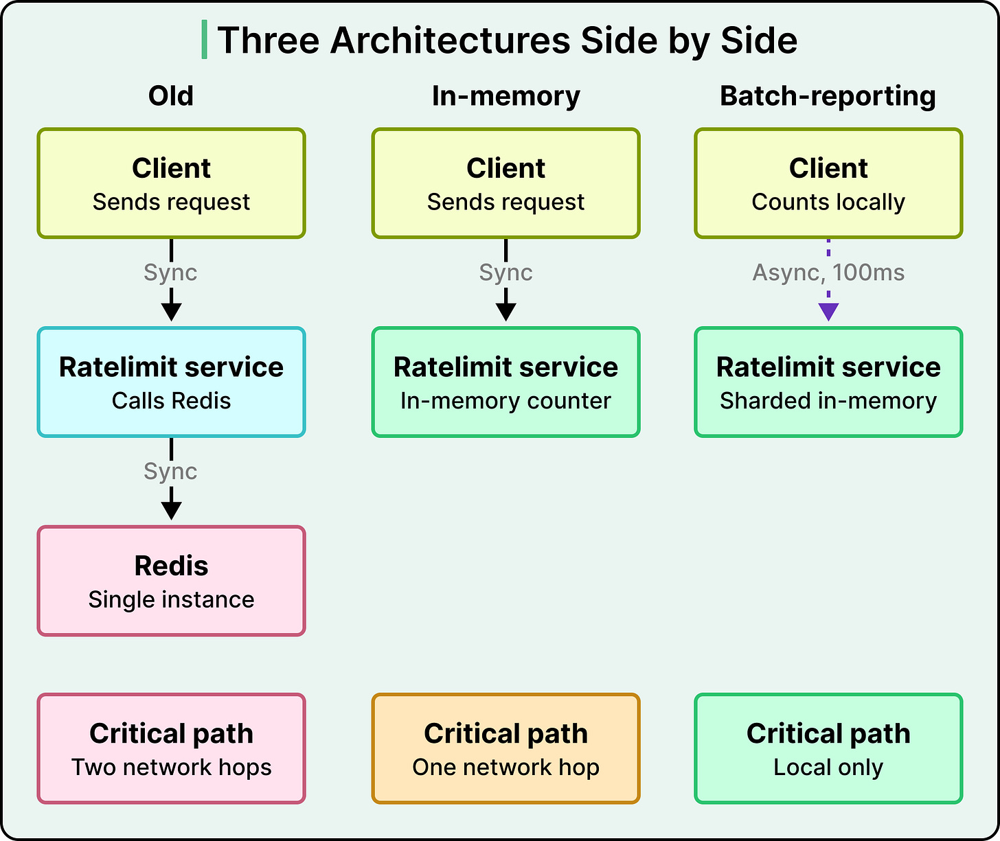

# Rate Limiting

## Key Takeaways

- Rate limiting is fundamentally a distributed counting problem — storage and sync patterns matter more than algorithm choice
- Three design decisions are interdependent: algorithm (fixed/sliding/token bucket), state location (Redis vs. in-memory vs. sharded), and sync model (synchronous vs. async batch)
- Databricks traded strict accuracy for speed by accepting "bounded imperfection" (~5% overshoot) — not suitable for strict billing/contractual quotas
- Moving from synchronous per-request checks to async batch-reporting reduced tail latency ~10x

## Databricks Rate Limiting Evolution

### The Problem

Original architecture: Envoy ingress → Ratelimit Service → single Redis instance.

- P99 latency: 10–20ms (two network hops)
- Horizontal scaling hit diminishing returns
- Single Redis = single point of failure

### Phase 1: In-Memory Sharded Counting

Moved counters from Redis into server memory using Dicer (internal routing layer for stateful services). Eliminated Redis hop, enabled horizontal scaling via key partitioning, removed SPOF. But clients still made synchronous calls per request.

### Phase 2: Batch-Reporting (Optimistic Rate Limiting)

Key insight: not every request needs to wait for a rate limit decision.

- Requests proceed optimistically by default
- Clients count locally and report metrics async every ~100ms
- Server responds with rejection instructions for keys over limit

Inverted the model from "ask before deciding" to "tell after deciding." Tail latency fell ~10x.

### Phase 3: Token Bucket Algorithm

With in-memory storage, compare-and-set became cheap enough for token bucket:

- Continuous fill/drain prevents double-rate bursts at window boundaries
- Negative buckets enforce limits across intervals
- Approximates sliding window without reset anomalies

### Bounding Overshoot (~5%)

Three mechanisms constrain the batch-reporting gap:

1. **Rejection rate calculations** — predict near-future demand from past traffic
2. **Client-side local rate limiter** — defense-in-depth for traffic spikes
3. **Token bucket** — remembers and corrects overages across intervals

## Three Coupled Design Decisions

| Decision | Options | Databricks Choice |
|---|---|---|
| **Algorithm** | Fixed window / sliding window / token bucket | Token bucket |
| **State location** | External store (Redis) / single-server / sharded in-memory | Sharded in-memory (Dicer) |
| **Sync model** | Synchronous per-request / async batch | Async batch (~100ms) |

The dependency chain: token bucket needs cheap CAS → rules out Redis at their QPS → requires in-memory → demands sharding → enables batch-reporting.

## Key Tradeoff

Databricks explicitly accepted bounded imperfection for speed and resilience. Systems enforcing strict billing or contractual quotas would need synchronous checks and external state.

---

**Source:** https://blog.bytebytego.com/p/high-performance-rate-limiting-at
**Date:** 2026-05-24
**Tags:** rate-limiting, system-design, distributed-systems, token-bucket, databricks
