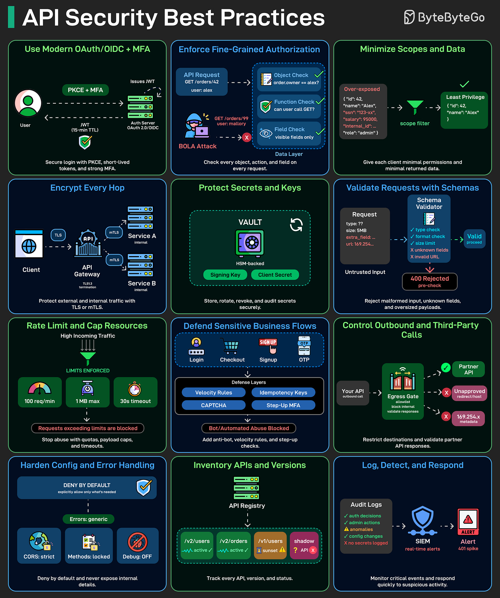

# API Security Best Practices

## Key Takeaways

- **BOLA (Broken Object Level Authorization) is the #1 API vulnerability** — authentication alone is not authorization; every request needs object-level, function-level, and field-level permission checks
- Token scope minimization and data minimization are the same principle applied in two directions: tokens carry only the permissions they need, responses return only the fields the caller needs
- Encryption is required at every network hop — TLS for external traffic, mTLS between internal services; partial encryption creates blind spots attackers exploit
- Signing keys and secrets must live in HSM-backed vaults with automated rotation; hard-coded or long-lived secrets are a systemic risk
- API inventory hygiene is a prerequisite for everything else — you cannot secure what you have not catalogued

## The 12 Controls

### 1. Use Modern OAuth/OIDC + MFA

- **PKCE** is required for public clients (SPAs, mobile apps) to prevent authorization code interception
- Tokens should be short-lived; step-up MFA should gate sensitive operations rather than applying blanket re-authentication
- OIDC adds an identity layer on top of OAuth's authorization framework

### 2. Enforce Fine-Grained Authorization

Every API request must pass three checks:

- **Object-level** — does this user own this record? Prevents BOLA (OWASP API #1)
- **Function-level** — is this user allowed to call this endpoint?
- **Field-level** — should this user see this field in the response?

Authentication ≠ authorization. Verifying identity says nothing about what that identity is permitted to access.

### 3. Minimize Token Scopes and Response Data

- Tokens carry the least-privilege scope needed for the specific operation
- API responses filter to only the fields the caller actually needs — not full database records
- Same principle, two directions: minimize what you grant and minimize what you expose

### 4. Encrypt Every Hop

- **TLS** for all external (client-to-server) traffic
- **mTLS (mutual TLS)** between internal services — each service authenticates the other
- Encrypting only the public-facing edge while leaving internal service-to-service traffic unencrypted is a common and exploitable gap

### 5. Protect Secrets and Keys

- JWT signing keys and API secrets must live in **HSM-backed vaults** (HashiCorp Vault, AWS KMS, GCP Secret Manager)
- **Rotate automatically** — manual rotation is effectively no rotation in practice
- Hard-coded secrets in code or config files are not a shortcut; they are a breach waiting to happen

### 6. Validate Requests with Schemas

- API gateways enforce schema validation: reject requests with unknown fields, oversized payloads, or suspicious URL patterns before they reach application code
- First-line defense against injection attacks and payload-based DoS
- Fail closed — reject what doesn't match; don't pass it through

### 7. Rate Limit and Cap Resources

- Apply per-user quotas, payload size caps, and execution timeouts
- Requests exceeding limits are blocked, not just throttled
- Uncapped resource consumption enables denial-of-service and credential stuffing at scale

### 8. Defend Sensitive Business Flows

Flows that require extra protection (login, checkout, OTP, account creation):

- **Anti-bot controls** — CAPTCHA, velocity rules, device fingerprinting
- **Idempotency keys** — prevent duplicate submission of the same action
- **Step-up authentication** for high-risk operations (wire transfer, account deletion)

### 9. Control Outbound and Third-Party Calls

- **Allowlist all outbound HTTP calls** your API is permitted to make
- **Explicitly block** access to cloud metadata endpoints (AWS: `169.254.169.254`) — these are the primary SSRF targets and can expose instance credentials
- SSRF (Server-Side Request Forgery) is OWASP API #7 and consistently underestimated

### 10. Harden Config and Error Handling

- **CORS**: not a wildcard; explicitly list allowed origins
- **HTTP methods**: explicitly allow (not open); reject disallowed methods with 405
- **Debug endpoints**: disabled in production — no exceptions
- **Error responses**: generic — detailed stack traces leak implementation details to attackers

### 11. Inventory APIs and Versions

- Maintain a registry of every API endpoint across all versions and services
- **Shadow APIs** (undocumented endpoints still running) and **zombie APIs** (deprecated versions never decommissioned) are common breach vectors
- Other controls cannot protect endpoints that aren't known to exist

### 12. Log, Detect, and Respond

- Push authentication decisions, authorization failures, and anomalous traffic patterns to a **SIEM**
- Alert on 401/403 spikes — these are credential stuffing signals
- Detection is part of security posture — controls that are never audited drift over time

## Threat-to-Control Mapping

| Threat | Primary Control(s) |
|---|---|
| BOLA / broken authorization | Object/function/field-level checks (#2) |
| Token interception | OAuth/OIDC + PKCE (#1), short-lived tokens |
| Privilege escalation | Scope minimization (#3) |
| Internal MITM | mTLS (#4) |
| Key compromise | HSM vault + auto-rotation (#5) |
| Injection / DoS via payload | Schema validation (#6) |
| Credential stuffing | Rate limiting (#7), anti-bot (#8) |
| Business logic abuse | Idempotency keys + step-up auth (#8) |
| SSRF | Outbound allowlist + block metadata endpoints (#9) |
| Misconfiguration | Deny-by-default CORS/methods (#10) |
| Shadow/zombie API exposure | API registry (#11) |
| Undetected breach | SIEM + anomaly alerting (#12) |

## Related

- [oauth.md](oauth.md) — OAuth 2.0 flows, token types, PKCE
- [cybersecurity-fundamentals.md](cybersecurity-fundamentals.md) — CIA triad, STRIDE threat modeling, defense-in-depth
- [../../security/owasp-top-10.md](../../security/owasp-top-10.md) — BOLA is OWASP API Security #1; injection, SSRF
- [../rate-limiting.md](../rate-limiting.md) — rate limiting algorithms and implementation patterns
- [../api/api-concepts.md](../api/api-concepts.md) — API design foundations, HTTP semantics

---

**Source:** https://blog.bytebytego.com/i/203732633/api-security-best-practices
**Date:** 2026-06-28
**Tags:** api-security, oauth, oidc, pkce, mfa, bola, authorization, rate-limiting, mtls, secrets-management, cors, siem, ssrf, input-validation, api-gateway, owasp
