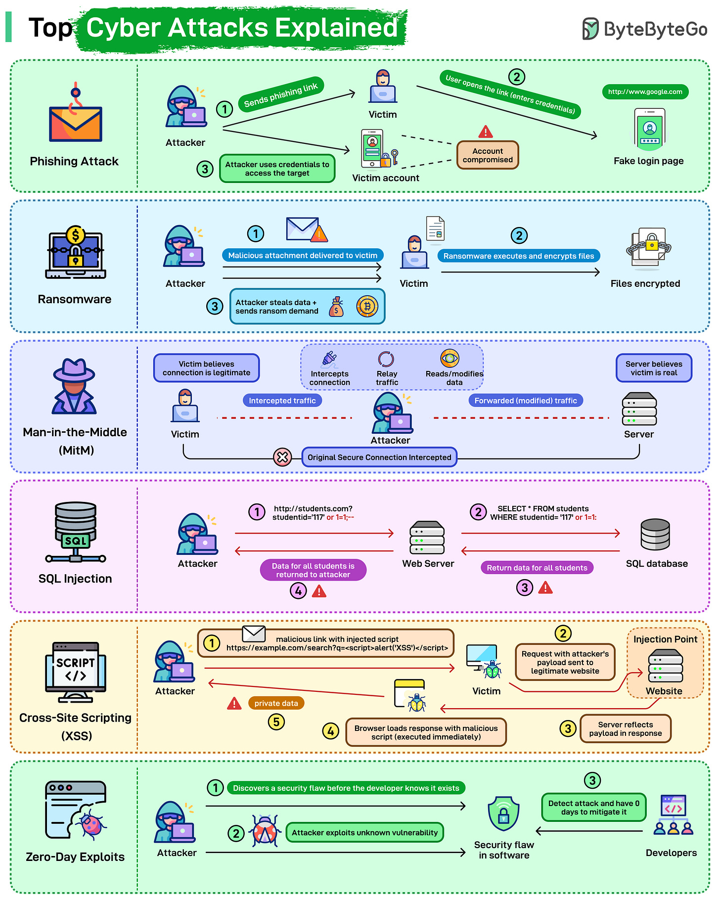

# Common Cyber Attacks

## Key Takeaways

- Six dominant attack classes — **phishing, ransomware, MitM, SQL injection, XSS, zero-day** — cover the bulk of real-world breach scenarios; most depend on a single weak input or a single careless click
- Defenses cluster into a small set of primitives: **input validation/encoding, encryption-in-transit, MFA, least privilege, backups, behavior-based monitoring** — each attack pairs with 3-4 layered defenses, not a silver bullet
- A single vulnerable input field (SQLi, XSS) can expose an entire database or session-token pool — **input handling is the highest-leverage control surface for web apps**
- **Zero-days have no patch by definition** — defense shifts to attack-surface reduction and anomaly detection rather than prevention
- People (phishing) and process (backups, patching) defenses matter as much as code-level controls



## Attack Taxonomy

The six classes organize by **primary attack vector**:

| Attack | Primary vector | Targets |
|---|---|---|
| **Phishing** | Human (deception) | Credentials, session cookies |
| **Ransomware** | Endpoint (file system) | Operational continuity |
| **MitM** | Network (in-transit data) | Confidentiality, integrity |
| **SQL Injection** | Application input (SQL parser) | Database |
| **XSS** | Application input (browser DOM) | Session tokens, user data |
| **Zero-day** | Unknown vulnerability | Anything in the affected component |

Each is a distinct failure surface; controls for one don't transfer to others.

## 1. Phishing

**Mechanic:** Attacker sends a link to a fake login page (looks identical to the real one). Victim enters credentials; attacker captures and replays them against the real system.

**Modern variants:**
- **AiTM (Adversary-in-the-Middle)** — fake site proxies the real one in real time, capturing both password AND MFA prompt response
- **Spear phishing** — targeted to a specific person using publicly known details
- **Whaling** — targeting executives
- **Vishing / smishing** — voice / SMS variants

**Defenses:**
- User training on suspicious URLs (hover before clicking, check spelling of domain)
- Email filtering, DMARC / SPF / DKIM
- **Phishing-resistant MFA (passkeys / FIDO2)** — cryptographic binding to the real domain makes AiTM mechanically impossible
- Conditional access (trusted device + location required for sensitive operations)

See [password-attacks.md § Phishing](password-attacks.md#5-phishing) for the credential-theft angle in depth.

## 2. Ransomware

**Mechanic:** Victim opens a malicious attachment or runs a compromised binary. Payload encrypts local data (and increasingly, attempts lateral movement to encrypt network shares and backups). Attacker demands payment for decryption key. Modern ransomware also exfiltrates data first for double-extortion ("pay or we publish").

**Defenses:**
- **Backups** — frequent, tested, **offline or immutable** (otherwise the ransomware encrypts them too). 3-2-1 rule: 3 copies, 2 media types, 1 offsite
- **Endpoint protection** — EDR with behavioral detection (mass file encryption is suspicious regardless of signature)
- **Email/file scanning** — block executable attachments by default
- **Least privilege** — most ransomware spreads through over-privileged service accounts
- **Network segmentation** — limit blast radius if one machine is hit
- **Patching** — most ransomware uses known vulnerabilities (EternalBlue, Log4Shell, etc.)
- **Incident response plan** — know in advance whether you'd pay; have legal/insurance contacts ready

The decision to pay is contentious — paying funds future attacks; not paying may mean permanent loss. Insurers increasingly refuse to pay. The pragma: invest in backups so you never have to decide.

## 3. Man-in-the-Middle (MitM)

**Mechanic:** Attacker positions themselves between victim and server (rogue Wi-Fi, ARP spoofing, BGP hijacking, compromised router) and intercepts bidirectional traffic. Without TLS, they read everything; with broken TLS, they can substitute certificates and read encrypted traffic too.

**Defenses:**
- **HTTPS / TLS everywhere** — modern baseline; HSTS prevents downgrade
- **Certificate pinning** — apps refuse certificates not in a hardcoded set; defeats rogue CA attacks
- **Mutual TLS (mTLS)** — both ends authenticate to each other (see [service-mesh-and-sidecar.md](../service-mesh-and-sidecar.md))
- **VPN** for untrusted networks (public Wi-Fi)
- **DNS over HTTPS / DNSSEC** — prevent DNS-level interception
- **Network segmentation** — limit attacker's ability to position themselves

For service-to-service comms, mTLS is the default. For user-to-service, the browser handles most of this if you serve over HTTPS with HSTS.

## 4. SQL Injection

**Mechanic:** Malicious SQL is inserted into an input field; the application concatenates it into a query that the database then executes. A single vulnerable input can dump entire tables, escalate privileges, or modify data.

Classic example:
```python
# VULNERABLE — never do this
query = f"SELECT * FROM users WHERE name = '{user_input}'"

# user_input = "'; DROP TABLE users; --"
# Resulting query:
#   SELECT * FROM users WHERE name = ''; DROP TABLE users; --'
```

**Defenses:**
- **Parameterized queries / prepared statements** — the only real defense; SQL and data travel separately, so user input is never parsed as SQL
  ```python
  cursor.execute("SELECT * FROM users WHERE name = %s", (user_input,))
  ```
- **ORM use** (which uses parameterized queries underneath) — but watch for raw-SQL escape hatches
- **Input validation** — defense in depth, not primary defense
- **Least-privilege DB accounts** — the app's DB user shouldn't be able to `DROP TABLE`
- **WAFs (Web Application Firewalls)** — catch obvious payloads as a last-line backstop
- **Static analysis** in CI to catch string-concatenated SQL

SQL injection has been #1 on OWASP Top 10 for decades. It persists because string concatenation is easy and parameterization requires deliberate effort.

## 5. Cross-Site Scripting (XSS)

**Mechanic:** Malicious script is injected into a legitimate page; when other users load the page, their browser executes the attacker's code in the site's origin — letting it steal session tokens, cookies, or user data.

**Three flavors:**
- **Stored XSS** — script saved to DB (e.g., in a comment field) and served to every viewer
- **Reflected XSS** — script in URL parameter echoed into the response (one-time, often delivered via phishing)
- **DOM-based XSS** — client-side JS pulls untrusted input from the URL and injects it into the DOM

**Defenses:**
- **Output encoding** — encode untrusted data per context (HTML, attribute, JS, URL) before rendering. Modern frameworks (React, Vue, Svelte) do this by default; danger arises from `dangerouslySetInnerHTML` / `v-html`
- **Content Security Policy (CSP)** — browser-enforced rules on what scripts can run; `nonce` or `sha256` allowlists
- **HttpOnly cookies** — JavaScript can't read them, so even successful XSS can't steal session tokens
- **SameSite cookies** — limit cross-site request consequences
- **Input sanitization** for HTML user inputs (e.g., DOMPurify) — only when you must allow some HTML
- **Avoid `eval()`, `Function()`, `innerHTML`** with user input

CSP is the most underused defense. A strict CSP turns most XSS bugs into bug reports instead of breaches.

## 6. Zero-Day Exploits

**Mechanic:** Attacker exploits a vulnerability the vendor hasn't yet discovered. No patch exists. By definition, signature-based defenses fail because the signature doesn't exist yet.

Famous examples: Log4Shell (Dec 2021), EternalBlue (NSA leak, 2017), Heartbleed (2014), the steady stream of iOS/Android jailbreak chains.

**Defenses:**
- **Attack surface reduction** — fewer exposed services, fewer libraries, fewer permissions = fewer 0-day exposure
- **Behavior-based detection** — unusual outbound connections, unusual file access patterns, lateral movement (catches the post-exploitation phase)
- **Threat monitoring** — CISA advisories, vendor security mailing lists; have a fast-patch process ready
- **Defense in depth** — assume one layer will fall to a 0-day; layered defenses limit blast radius
- **Patch management** — most "zero-days" being exploited at scale are actually weeks-old N-days where the patch exists but hasn't been applied
- **Software composition analysis (SCA)** — know your dependencies; respond fast when a CVE drops

Zero-day defense is mostly about **time-to-patch** and **limiting damage** rather than prevention. Assume you'll be exposed at some point; design for that.

## Defenses by Primitive

Pulling apart the table of defenses, the same primitives keep appearing across attack classes:

| Primitive | Defends against |
|---|---|
| **Encryption in transit (TLS, mTLS)** | MitM |
| **Encryption at rest** | Data leak post-breach |
| **Input validation + output encoding** | SQLi, XSS, command injection |
| **Parameterized queries** | SQLi |
| **CSP** | XSS |
| **MFA (especially passkeys)** | Phishing, credential theft |
| **Least privilege** | Ransomware lateral movement, SQLi blast radius |
| **Backups (offline/immutable)** | Ransomware |
| **Patching** | Known CVEs, post-disclosure 0-days |
| **Behavior-based monitoring** | Ransomware, 0-day post-exploit |
| **Network segmentation** | Lateral movement of any kind |
| **User training** | Phishing, social engineering |
| **EDR** | Ransomware, keyloggers, malware |

Build the primitives; they amortize across many attack classes.

## OWASP Top 10 Context

The OWASP Top 10 (revised periodically) is the canonical list of the most common application security risks. The attacks above map to it roughly:

| ByteByteGo article | OWASP Top 10 (2021) |
|---|---|
| SQL Injection, XSS | A03: Injection |
| Phishing (credential theft) | A07: Identification and Authentication Failures |
| MitM | A02: Cryptographic Failures |
| Zero-day | A06: Vulnerable and Outdated Components (for unpatched n-days) |
| Ransomware | Cross-cutting — typically arrives via A05 (Security Misconfiguration) or A06 |

OWASP also includes Broken Access Control (A01, the new #1), SSRF (A10), and Insecure Design (A04) — worth reading the full list for any production web app.

## Related

- [Password attacks](password-attacks.md) — credential-specific attacks in depth
- [Password storage and hashing](password-storage-hashing.md) — defense if your DB is breached
- [SSO](sso.md) — centralizes auth so MFA is enforced once
- [OAuth](oauth.md) — delegated auth without password sharing
- [Service mesh and sidecar](../service-mesh-and-sidecar.md) — mTLS by default
- [Distributed system failure modes § cascading failures](../distributed-system-failure-modes.md) — DDoS lives at the intersection of cyber attack and reliability engineering

---

**Source:** https://blog.bytebytego.com/i/190810886/top-cyber-attacks-explained
**Date:** 2026-06-04
**Tags:** security, cyber-attacks, phishing, ransomware, sql-injection, xss, mitm, zero-day, owasp, defense-in-depth, csp, mtls, input-validation
