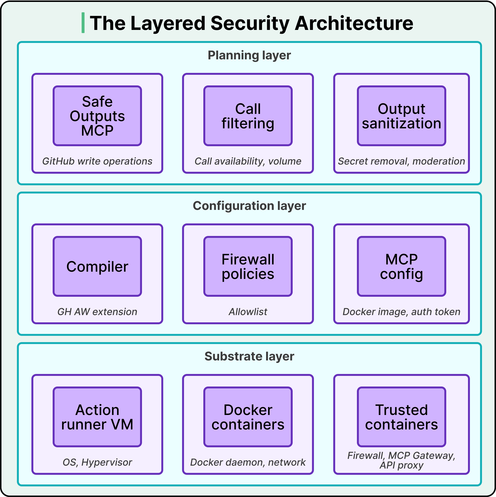
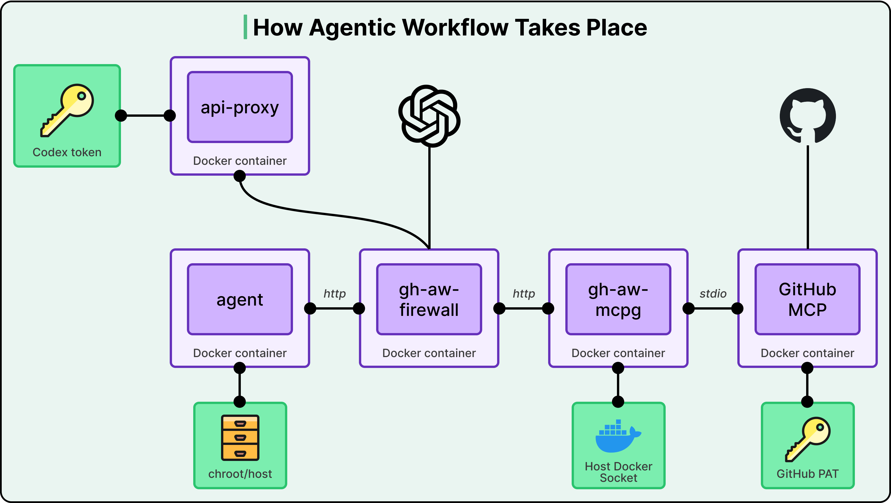
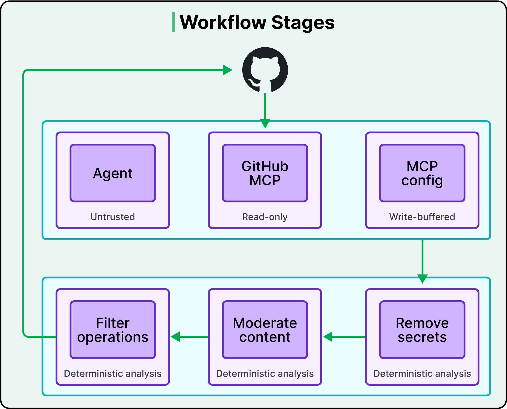

# GitHub Agentic Workflow Security Architecture

## Key Takeaways

- GitHub assumes AI agents will be compromised and builds a three-layer defense-in-depth architecture (substrate, configuration, planning) where each layer functions independently
- The agent never touches secrets -- authentication tokens live in separate containers (firewall, MCP gateway, API proxy), and the host filesystem is mounted read-only with sensitive paths masked by in-memory tmpfs
- All agent outputs are buffered through a deterministic "Safe Outputs" pipeline that enforces type-checking, quantity limits, and secret scanning before any write operation reaches GitHub
- Prompt injection remains fundamentally unsolved; this architecture is a damage containment strategy, not a prevention strategy
- Unlike Claude Code and Gemini CLI (which make sandboxing optional), GitHub enforces strict-by-default isolation at the cost of developer flexibility

## Three Layers of Distrust

GitHub's security model is built on the assumption that the agent will be compromised. Three independent layers ensure that a breach in one does not cascade to the others.

### Substrate Layer (Foundation)

The lowest layer provides hardware and OS-level isolation:

- **Actions Runner VM** -- each workflow gets its own ephemeral virtual machine with hypervisor-level isolation
- **Docker containers** -- the agent runs in its own container on a private Docker network, physically separated from trusted components
- **Trusted containers** -- the firewall (`gh-aw-firewall`), MCP gateway (`gh-aw-mcpg`), and API proxy run in separate containers that the agent cannot access directly

This layer functions even if the agent's code is fully compromised because isolation is enforced at the kernel level.

### Configuration Layer (Structure)

This layer compiles workflow definitions into constrained runtime policies:

- **Compiler** -- the GitHub Agentic Workflows (GH AW) extension transforms YAML workflow definitions into container configurations
- **Firewall policies** -- an allowlist determines which domains the agent can reach through the firewall
- **MCP config** -- defines which MCP tools are available, which Docker images to use, and which authentication tokens to inject into which containers

Secrets are loaded only into specific trusted containers, never into the agent's container.

### Planning Layer (Execution Timeline)

The highest layer governs what happens at runtime:

- **Safe Outputs MCP** -- buffers all GitHub write operations for review before execution
- **Call filtering** -- enforces limits on call availability and volume
- **Output sanitization** -- scans for leaked secrets and applies content moderation

## Container Topology: Zero-Secret Agent Design

The agent container has no direct internet access and holds no secrets. All external communication is mediated by trusted sidecar containers.

The data flow works as follows:

1. **Agent to LLM** -- the agent sends requests via HTTP to the `api-proxy` container, which holds the Codex token and forwards to the LLM API
2. **Agent to internet** -- all outbound HTTP routes through `gh-aw-firewall`, which enforces the domain allowlist
3. **Agent to GitHub** -- requests go through `gh-aw-firewall` to `gh-aw-mcpg` (MCP gateway) via HTTP, then to `GitHub MCP` via stdio. The MCP gateway holds the GitHub PAT; the agent never sees it
4. **Agent to filesystem** -- the host filesystem is mounted read-only via chroot, with sensitive paths (like `/etc/secrets`) masked by temporary in-memory filesystems

At no point in this chain does the agent touch a secret.

## Safe Outputs Pipeline

All agent outputs are buffered and validated through a deterministic pipeline before they produce real-world effects.

The pipeline applies three checks in sequence:

1. **Remove secrets** -- deterministic analysis scans output for any leaked credentials or tokens
2. **Moderate content** -- deterministic content moderation checks for policy violations
3. **Filter operations** -- deterministic analysis validates operations against author-defined allowlists (type checking and quantity limits)

Only after passing all three stages do the operations execute against GitHub. This ensures that even a prompt-injected agent cannot exfiltrate secrets or perform unauthorized bulk operations.

## Observability and Logging

Comprehensive logging occurs at every trust boundary:

- **Firewall** logs all network activity (domains contacted, requests blocked)
- **API proxy** captures authentication requests to the LLM
- **MCP gateway** tracks every tool invocation with parameters
- **Internal instrumentation** audits sensitive actions within each container

This creates a full audit trail for forensic analysis when incidents occur.

## Design Tradeoffs

| Dimension | GitHub's Choice | Alternative |
|---|---|---|
| Default posture | Strict-by-default isolation | Opt-in sandboxing (Claude Code, Gemini CLI) |
| Secret handling | Architecture-enforced zero-secret agent | Trust-based secret injection |
| Output handling | Buffered deterministic vetting | Real-time agent execution |
| Complexity | High (multiple containers, proxies) | Simpler single-process model |

The article acknowledges that this level of complexity is justified at GitHub's scale but may be excessive for smaller deployments.

## Transferable Principles

Four design patterns applicable to any organization deploying AI agents:

1. **Defense-in-depth** -- independent security layers that each function on their own
2. **Architecture-based secret isolation** -- secrets never enter the agent's address space
3. **Deterministic output vetting** -- all agent actions pass through non-AI validation before taking effect
4. **Comprehensive logging at trust boundaries** -- every boundary crossing is recorded for audit

---

**Source:** https://blog.bytebytego.com/p/the-security-architecture-of-github
**Date:** 2026-05-31
**Tags:** security, ai-agents, github, defense-in-depth, container-isolation, mcp, zero-trust
