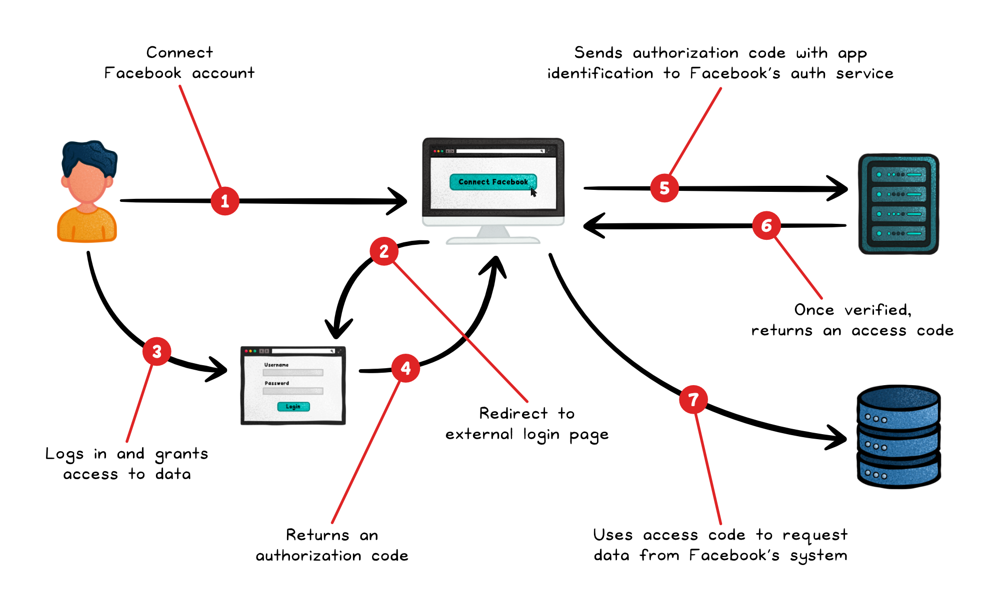
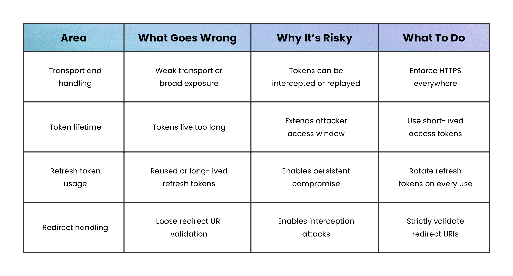
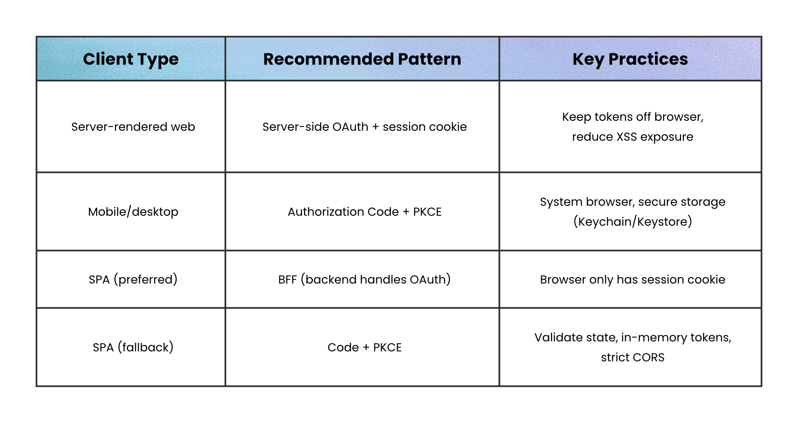

# OAuth

## Key Takeaways

- OAuth is a permission mechanism, not a login system — it lets one app access another service with limited permissions without requiring the user's password
- Three token types serve different jobs: access tokens (short-lived API credentials), refresh tokens (long-lived, used only to get new access tokens), and ID tokens (OIDC identity claims — not part of OAuth itself)
- Bearer tokens are inherently risky — possession alone enables usage with no cryptographic binding; token leakage equals credential theft
- Implementation pattern depends on client type: server-side apps use session cookies, mobile uses PKCE + secure storage, SPAs ideally use Backend-for-Frontend (BFF)

## Authorization Code Flow

**Four roles:**

- **Resource owner** — the user controlling data and consent
- **Client** — the requesting application
- **Authorization server** — issues tokens after verifying identity and consent
- **Resource server** — hosts protected data, validates tokens per request

**Flow:** Client redirects user to auth server → user authenticates and consents → server returns authorization code → client exchanges code for access token via secure back-channel → access token accompanies each API request. User credentials never touch the client.

## Three Token Types

- **Access token** — short-lived, included with API calls, validated by resource server each request
- **Refresh token** — long-lived, used solely at token endpoint to get new access tokens without re-authentication; never sent to APIs
- **ID token** — signed JWT with identity claims (who, when, by whom); belongs to OpenID Connect (OIDC), not OAuth itself

Using access tokens as login proof is one of the most frequent implementation errors.

## Security Risks

**Leak vectors:** logs, query strings, browser storage, referrer headers, weak transport

**Mitigations:** HTTPS everywhere, short access token lifespans, careful token storage, rotate refresh tokens on every use, strictly validate redirect URIs

**Advanced (sender-constrained tokens):**

- **mTLS** — ties token to client TLS certificate
- **DPoP** — binds token to client-controlled key pair

## Implementation by Client Type

| Client Type | Pattern | Key Practice |
|---|---|---|
| Server-rendered web | Server-side OAuth + session cookie | Keep tokens off browser, reduce XSS exposure |
| Mobile/desktop | Authorization Code + PKCE | System browser, secure storage (Keychain/Keystore) |
| SPA (preferred) | BFF (backend handles OAuth) | Browser only has session cookie |
| SPA (fallback) | Code + PKCE | Validate state, in-memory tokens, strict CORS |

---

**Source:** https://blog.levelupcoding.com/p/oauth-clearly-explained
**Date:** 2026-05-28
**Tags:** oauth, oidc, authentication, authorization, security, tokens, pkce
