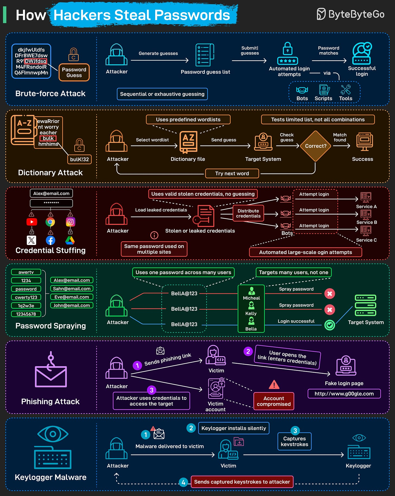

# Password Attacks

## Key Takeaways

- Password attacks split into two classes: **guessing** (brute force, dictionary, spraying) and **theft** (credential stuffing, phishing, keyloggers) — each class needs different defenses
- **Credential stuffing** is the most damaging because it exploits password reuse — one breach cascades across every service the user shares passwords with
- **Password spraying** (one common password tried across many accounts) defeats per-account lockouts; you need **org-wide anomaly detection** to catch it
- **Phishing and keyloggers bypass password strength entirely** — strong passwords don't help if the user types them into a fake form or has a keylogger on their machine
- Defense is layered: rate limits + lockouts + MFA + password managers + breach monitoring + endpoint protection — no single control covers all six vectors



## Two Categories of Attack

```
Guessing attacks                 Theft attacks
────────────────                 ─────────────
1. Brute force                   3. Credential stuffing
2. Dictionary                    5. Phishing
4. Password spraying             6. Keylogger malware
```

The asymmetry: **guessing attacks** try to discover an unknown password against a hardened endpoint; **theft attacks** acquire a known password and reuse it. Defenses for one class do nothing for the other.

## 1. Brute Force

**Mechanic:** Automated tools cycle through password combinations at high speed against the login endpoint until one works.

**Defenses:**
- **Rate limiting** — limit auth attempts per IP / per user / per minute
- **Account lockouts** — temporary lock after N failed attempts (with backoff)
- **CAPTCHA** — slow down automated tools after failures
- **Strong password policy** — increase the search space (length matters more than complexity)
- **Argon2id / bcrypt hashing on the backend** — even if hashes leak, brute-forcing them is impractical (see [password-storage-hashing.md](password-storage-hashing.md))

## 2. Dictionary Attacks

**Mechanic:** Like brute force, but the attacker uses curated wordlists — common passwords, leaked passwords from prior breaches, names + dates, predictable patterns (`Password1!`, `Summer2025`).

**Defenses:**
- **Reject known-breached passwords** — check against [HaveIBeenPwned passwords API](https://haveibeenpwned.com/Passwords) at signup
- **Password complexity rules** that catch common patterns (not just "must have uppercase + number")
- **Length requirements** — long passphrases beat short complex passwords
- All the brute-force defenses above

## 3. Credential Stuffing

**Mechanic:** A site gets breached. Attackers acquire `username + password` pairs and **replay them against many other sites**, exploiting password reuse.

This is the most consequential attack because:
- It targets users who did nothing wrong on the attacked site
- It's cheap — automated, no guessing needed
- It works at scale — ~30% of users reuse passwords across major services
- Per-site defenses (rate limits, lockouts) don't help because each individual attempt succeeds

**Defenses:**
- **Unique passwords per account** (enforce via password managers)
- **MFA** — even if password is correct, second factor blocks login
- **Breach monitoring** — proactively notify users whose credentials appeared in known breaches
- **Anomalous login detection** — sudden logins from new locations/devices, especially shortly after a public breach
- **Risk-based authentication** — step up to MFA when context looks suspicious

## 4. Password Spraying

**Mechanic:** Instead of guessing many passwords against one account (triggering lockouts), try **one common password against many accounts**: `attacker@victim-org tries Spring2026! across every employee email`.

The trick: per-account lockout policies see 1 failed attempt per account and never trigger. The attack is invisible to per-user defenses.

**Defenses:**
- **Org-wide anomaly detection** — many distinct accounts failing within a short window from the same source IP
- **Per-source-IP rate limiting** in addition to per-account
- **Disallow known-common passwords** (block `Spring2026!`, `Password123`, etc.)
- **MFA on all accounts** — kills the attack regardless of password
- **Conditional access** — require corporate device or VPN for org auth

Spraying is the favored technique against enterprise email systems (Microsoft 365, Okta) because it evades most legacy defenses.

## 5. Phishing

**Mechanic:** Attacker sends a link to a spoofed login page (looks identical to the real one). Victim enters credentials. Attacker captures them in real time and uses them — often immediately, before the user realizes.

**Modern variants:**
- **Adversary-in-the-Middle (AiTM)** phishing — the fake site proxies the real one, capturing both password AND the MFA prompt response → MFA is bypassed
- **Vishing** (voice) — call from "IT support" asking for a code
- **Smishing** — SMS-based; targets MFA codes especially

**Defenses:**
- **User training** — recognize suspicious URLs, hover before clicking
- **Email filtering / DMARC / SPF / DKIM** — block spoofed sender domains
- **MFA** — slows but doesn't stop AiTM
- **Phishing-resistant MFA** — FIDO2 hardware keys (YubiKey, Titan), passkeys — these cryptographically bind the auth to the real domain, so the fake site simply can't replay
- **Conditional access** — require trusted device / IP / location for sensitive operations

Phishing-resistant MFA (passkeys / WebAuthn) is the only meaningfully *new* defense in the past decade. Everything else slows attackers; passkeys make the attack mechanically impossible because the signature is bound to the requesting origin.

## 6. Keylogger Malware

**Mechanic:** Malicious software on the victim's machine captures keystrokes (passwords, MFA codes, session cookies) and transmits them to the attacker. Variants also screenshot, capture clipboard, or hijack sessions directly.

**Defenses:**
- **Endpoint protection** — EDR / antivirus to detect known malware
- **Behavioral monitoring** — flag unusual processes accessing input devices
- **Hardware security keys** — keylogger captures the password but can't replay a U2F/FIDO challenge from another machine
- **Patch management** — most keyloggers arrive via known vulnerabilities
- **Least privilege** — limit what's compromised if the user account is taken over
- **OS-level mitigations** — secure input modes (macOS), credential guard (Windows)

Keyloggers bypass everything else (password strength, MFA secret length, even server-side anomaly detection — the login looks legitimate). Hardware keys are the only consumer defense that holds up.

## Defense Matrix

| Defense | Brute force | Dictionary | Cred stuffing | Spraying | Phishing | Keylogger |
|---|:-:|:-:|:-:|:-:|:-:|:-:|
| Rate limiting (per-account) | ✅ | ✅ | partial | ❌ | ❌ | ❌ |
| Rate limiting (per-source) | ✅ | ✅ | ✅ | ✅ | ❌ | ❌ |
| CAPTCHA | ✅ | ✅ | ✅ | partial | ❌ | ❌ |
| Account lockout | ✅ | ✅ | partial | ❌ | ❌ | ❌ |
| MFA (TOTP, SMS) | ✅ | ✅ | ✅ | ✅ | partial | partial |
| MFA (FIDO2 / passkey) | ✅ | ✅ | ✅ | ✅ | ✅ | partial |
| Unique passwords | n/a | n/a | ✅ | n/a | n/a | n/a |
| Password manager | partial | partial | ✅ | n/a | partial | n/a |
| Breach monitoring | n/a | n/a | ✅ | n/a | n/a | n/a |
| Org-wide anomaly detection | partial | partial | ✅ | ✅ | partial | partial |
| Endpoint protection | n/a | n/a | n/a | n/a | n/a | ✅ |
| User training | n/a | n/a | n/a | n/a | ✅ | partial |

No row has ✅ in every column. **Layered defense is mandatory.**

## What an Account-Takeover Defense Stack Looks Like

For a typical SaaS:

1. **Strong KDF on stored passwords** ([Argon2id](password-storage-hashing.md))
2. **Reject breached passwords at signup** (HaveIBeenPwned check)
3. **Per-user and per-IP rate limiting** with backoff
4. **CAPTCHA after N failures**
5. **MFA required for sensitive operations** (passkeys preferred)
6. **Org-wide spraying detection** (look for many accounts failing same password)
7. **Breach monitoring** — notify users when their email + a prior reused password shows up in a new dump
8. **Anomalous-login alerts** — new device, new country, impossible-travel detection
9. **Step-up auth** — re-prompt MFA before account changes, payment changes, key exports

The work is in tuning thresholds so legitimate users aren't friction-trapped while attackers are.

## Related

- [Password storage and hashing](password-storage-hashing.md) — what protects credentials at rest
- [SSO](sso.md) — eliminates per-app passwords entirely
- [OAuth](oauth.md) — delegated auth without password sharing
- [Common cyber attacks](common-cyber-attacks.md) — broader attack taxonomy including non-credential attacks

---

**Source:** https://blog.bytebytego.com/i/191425883/how-hackers-steal-passwords
**Date:** 2026-06-04
**Tags:** security, password-attacks, brute-force, credential-stuffing, password-spraying, phishing, keylogger, mfa, passkey, fido2, authentication
