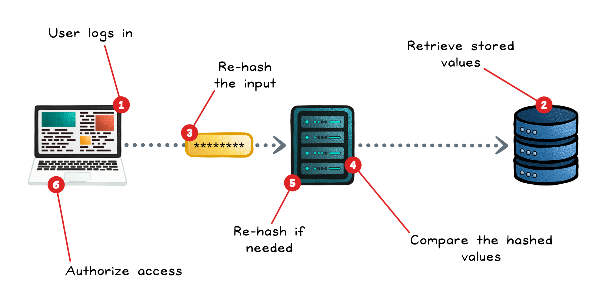
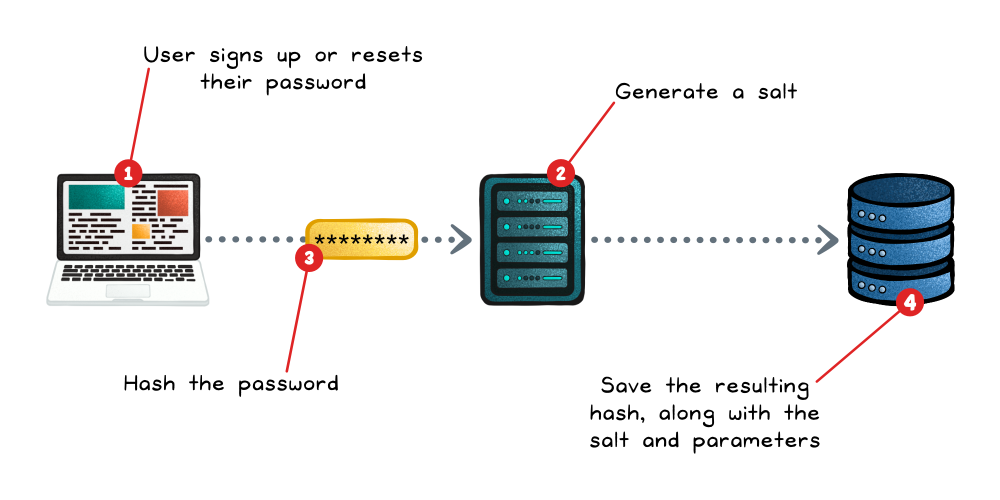
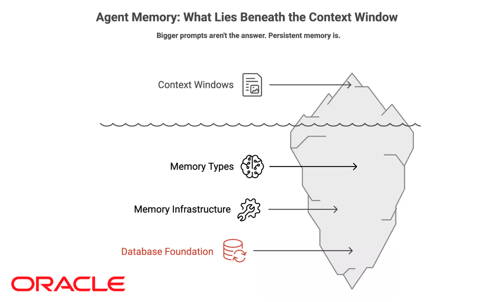

# Password Storage and Hashing

## Key Takeaways

- **Never store plaintext passwords.** The server doesn't need the original after signup — only proof the user knows it. A breach of plaintext means every credential is compromised
- Use a **password-specific KDF** (Argon2id > bcrypt > scrypt > PBKDF2) — never fast general-purpose hashes (MD5, SHA-1, SHA-256), which attackers can compute billions of times per second on commodity GPUs
- **Unique random salt (≥16 bytes) per user** — defeats rainbow tables and ensures two users with the same password get different stored hashes; the salt is not a secret, just a uniqueness guarantee
- **Tune the work factor** so a legitimate login takes a fraction of a second on production hardware; the old bcrypt cost=8 default is now too low; revisit annually
- **Pepper (optional defense-in-depth)** — a server-side secret in an HSM or key vault that gets mixed in before hashing; if only the DB leaks, the attacker can't even test guesses



## Why Plaintext Storage Fails

A single breach — SQL injection, leaked backup, insider access — exposes every credential. And because users reuse passwords across services, one plaintext leak cascades into account takeovers on every other site those users have accounts on (see [password-attacks.md](password-attacks.md) for credential stuffing).

The mental model: **the server doesn't need to know the password to verify it.** Store only enough to confirm a future login matches. That "enough" is a one-way hash.

## Hashing Fundamentals

A cryptographic hash is a one-way function: input → fixed-size digest, with no feasible inverse.

```
"correct horse battery staple"  ──hash──>  d7a8fbb307d7809469ca9abcb0082e4f8d5651e46d3cdb762d02d0bf37c9e592
```

The server stores the digest. At login time, it re-hashes the submitted password and compares.

### Why General-Purpose Hashes Are Wrong for Passwords

| Algorithm | Speed on a modern GPU | Suitable for passwords? |
|---|---|---|
| MD5 | ~200 billion hashes/sec | ❌ Also cryptographically broken |
| SHA-1 | ~50 billion hashes/sec | ❌ Cryptographically weakened |
| SHA-256 | ~10 billion hashes/sec | ❌ Too fast |
| bcrypt (cost=12) | ~2,000 hashes/sec | ✅ |
| Argon2id (m=64MB, t=3) | ~100 hashes/sec | ✅ |

General-purpose hashes are designed to be *fast* — which is exactly what an attacker brute-forcing leaked password hashes wants. Password KDFs are designed to be *slow* and *memory-hard*, which doesn't matter for a single legitimate login (200ms is fine) but cripples attackers trying billions of guesses.

## Salting

Add a unique random value to each password before hashing:

```
stored_hash = KDF(password + salt, work_factor)
stored: (user_id, salt, stored_hash, work_factor)
```

### What Salting Defeats

| Attack | Without salt | With salt |
|---|---|---|
| **Rainbow table** | Attacker pre-computes hash of every possible password once, looks up your DB | Useless — table would have to be rebuilt per salt |
| **Identical-password discovery** | All users with `password123` have the same hash → attacker cracks one, gets all | Each user's hash is unique |
| **Bulk cracking** | Crack 1M hashes in the time it takes to crack 1 | Each hash must be cracked independently |

### Salt Requirements

- **Unique per user** — never reuse across accounts
- **Random** — from a CSPRNG, not a counter
- **≥16 bytes** — enough to defeat any precomputation
- **Stored alongside the hash** — not a secret; pepper is the secret if you want one

## Key Stretching (Work Factor)

Password KDFs intentionally slow down hashing via:
- **Iterations** — repeat the inner hash N times (PBKDF2)
- **Memory cost** — require MB of memory per hash to defeat GPU/ASIC attacks (scrypt, Argon2)
- **Parallelism cost** — tune for CPU/memory-bound work over GPU-friendly parallelism (Argon2)

### Tuning Cost

Pick a cost so one hash takes **~250ms-1s** on the login server. Legitimate users don't notice; attackers running billions of guesses see their economics collapse.

| KDF | Parameter | Reasonable 2026 starting point |
|---|---|---|
| **Argon2id** | m=64MB, t=3, p=4 | Recommended default |
| **bcrypt** | cost=12 (was 8 in 2012; raise it) | OK if Argon2 unavailable |
| **scrypt** | N=2^17, r=8, p=1 | OK |
| **PBKDF2-SHA256** | 600,000+ iterations | Last resort; FIPS-required environments |

**Revisit annually.** Hardware gets faster; what was "expensive" five years ago is cheap now. Bump cost factors and re-hash on next login.

## Peppering (Optional)

A **server-side secret** added before hashing, stored outside the database — in an HSM, KMS, or env var injected at runtime:

```
stored_hash = KDF(pepper + password + salt, work_factor)
```

The pepper is **the same for all users** but **not in the DB**. Effect:

| Scenario | Without pepper | With pepper |
|---|---|---|
| DB leaks, KMS doesn't | Attacker brute-forces hashes | Attacker can't test guesses — they lack the pepper |
| Both DB and KMS leak | Same outcome | Same outcome |

Pepper isn't a substitute for salt or strong KDF — it's an additional layer. Useful when you can guarantee strict separation between the DB and the secret store.

## Signup Flow



```
1. User submits password
2. Generate fresh random salt (CSPRNG, ≥16 bytes)
3. stored_hash = KDF(password + salt [+ pepper], current_cost)
4. INSERT INTO users (user_id, salt, hash, kdf_params) VALUES (...)
5. Discard plaintext from memory immediately
6. Return success
```

Plaintext should exist for milliseconds. Never log it, never email it, never store a "password hint" that's actually the password.

## Login Verification Flow



```
1. User submits username + password
2. Lookup: salt, stored_hash, kdf_params for username
3. computed_hash = KDF(password + salt [+ pepper], kdf_params)
4. Constant-time compare(computed_hash, stored_hash)
5. If match AND kdf_params < current_policy:
       silently re-hash with current params, update stored_hash
6. If match: issue session token
7. If not: return generic auth-failed (don't reveal whether the username exists)
```

### Constant-Time Comparison

Standard `==` on byte strings short-circuits on first mismatch — leaking how many leading bytes were correct via timing. Use:

- Python: `hmac.compare_digest()`
- Go: `subtle.ConstantTimeCompare()`
- Node: `crypto.timingSafeEqual()`
- Java: `MessageDigest.isEqual()`

### Transparent Upgrades

When you increase the cost factor (annual review), don't force a password reset on every user. Instead: on successful login, if the stored hash uses outdated params, re-hash the (now-known) plaintext with current params and update the DB. Over time, the whole user base migrates.

## Anti-Patterns to Avoid

| Anti-pattern | Why it's wrong |
|---|---|
| Storing plaintext | Catastrophic on breach |
| MD5 / SHA-1 / SHA-256 / SHA-3 alone | Too fast — designed for speed, attackers can brute-force trivially |
| Reusing salt across users | Defeats salting's purpose |
| Static / hardcoded salt | Same as above |
| No salt | Rainbow tables crack the DB in seconds |
| Low cost factor (bcrypt cost=8 in 2026) | Brute-force becomes feasible |
| Custom / "rolled-our-own" hash algorithm | You will get something wrong; use vetted KDFs |
| Logging passwords during debugging | Logs leak via aggregation systems |
| Storing password hints (often = the password) | "My dog's name was Rex" → password is `Rex` |
| Returning "username not found" vs "wrong password" | User enumeration |
| Sending plaintext password in confirmation email | Proves you're storing plaintext |

## What This Looks Like in Practice

A modern auth library (Devise/Argon2, passlib, bcryptjs, Spring Security) handles most of this. The decisions that remain to you:

- **KDF choice** — pick Argon2id unless you have a reason not to
- **Cost parameters** — benchmark on your production hardware, target ~250ms
- **Pepper** — only if you can guarantee DB/KMS separation; otherwise skip
- **Migration plan** — when you upgrade params, do transparent re-hashes on login

## Related

- [Password attacks](password-attacks.md) — what the storage above defends against
- [OAuth](oauth.md) — when you don't have to store passwords at all (delegate to an IdP)
- [SSO](sso.md) — same idea at organization scale
- [Common cyber attacks](common-cyber-attacks.md) — SQL injection (the DB-breach vector that makes hashing matter)

---

**Source:** https://blog.levelupcoding.com/p/how-databases-keep-passwords-safe
**Date:** 2026-06-04
**Tags:** security, password-hashing, argon2, bcrypt, scrypt, pbkdf2, salt, pepper, kdf, authentication, cryptography, database
