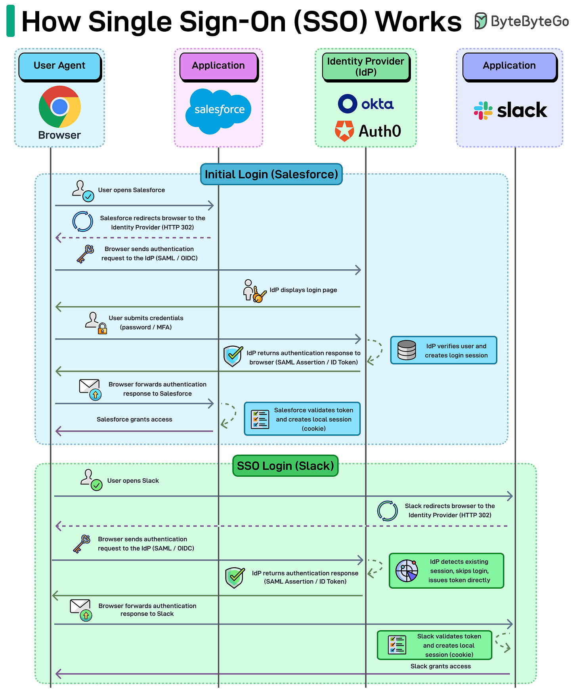

# Single Sign-On (SSO)

## Key Takeaways

- SSO centralizes the trust boundary: apps don't authenticate users themselves — they **delegate to an Identity Provider** (IdP like Okta, Auth0, Entra ID); Service Providers (apps like Slack, Salesforce) consume signed tokens/assertions
- The handshake is **browser-mediated** — HTTP 302 redirects move the user between SP and IdP; signed tokens establish trust without a backchannel call
- Two distinct sessions exist: the **IdP session** (long-lived, enables SSO) and **per-SP local sessions** (short-lived, app-specific)
- The "single" in SSO comes from the IdP session — subsequent logins to other SPs skip authentication entirely because the IdP recognizes the existing session
- **SAML** (XML assertions, enterprise) and **OIDC** (JSON ID tokens on OAuth 2.0, modern/consumer) are the two dominant protocols — same flow shape, different token formats



## Why SSO Exists

Without SSO, every app maintains its own:
- Credential store (more places passwords leak from)
- Login UI (each one a phishing target)
- Session model (no central revocation)
- MFA implementation (varying quality)

For a user with 50 SaaS apps at work, that's 50 places to log in, 50 password resets, 50 separate audit logs. For the organization, it's 50 places to enforce policy, 50 different lockout behaviors, and a real-world impossibility of deprovisioning a departing employee from all of them.

**SSO consolidates authentication into one trusted system** that every other app trusts.

## Actors

| Actor | Role | Examples |
|---|---|---|
| **User-Agent** | Browser, courier between SP and IdP | Chrome, Safari |
| **Service Provider (SP)** | The app the user wants to use | Slack, Salesforce, Jira, internal apps |
| **Identity Provider (IdP)** | The system that authenticates users and issues tokens | Okta, Auth0, Entra ID (Azure AD), Google Workspace, Ping Identity |

The IdP is the **trust root**. Every SP that federates with it is saying "I will believe identity claims signed by this IdP."

## The SSO Flow

### Initial login (cold)

```
1. User → SP                  GET /dashboard
2. SP → User (302)            redirect to IdP with auth request (signed)
3. User → IdP                 GET /authorize?...
4. IdP → User                 login page (creds + MFA)
5. User → IdP                 submit credentials
6. IdP creates IdP session    (long-lived cookie at idp.example.com)
7. IdP → User (302)           redirect back to SP with signed assertion/token
8. User → SP                  POST /assertion-consumer with token
9. SP validates signature     (and audience, expiry, nonce)
10. SP creates local session  (short-lived cookie at sp.example.com)
11. SP → User                 dashboard rendered
```

### Subsequent login to a second SP (warm)

```
1. User → SP-2                GET /dashboard
2. SP-2 → User (302)          redirect to IdP
3. User → IdP                 GET /authorize?...
                              (browser sends existing IdP-session cookie)
4. IdP recognizes session     — no login prompt
5. IdP → User (302)           redirect to SP-2 with fresh token
6. SP-2 validates, creates local session
7. SP-2 → User                dashboard
```

**The user sees a flicker but no login prompt.** That's the "single" in SSO.

## Two Sessions, Different Lifetimes

| Session | Where | Typical lifetime | Cleared by |
|---|---|---|---|
| **IdP session** | Cookie at idp.example.com | Hours to days | IdP logout, inactivity, policy |
| **Per-SP local session** | Cookie at sp.example.com | Minutes to hours | SP logout, expiry, refresh failure |

SSO logout has two flavors:
- **SP logout** — clears one app's session; IdP session remains; refreshing the page re-authenticates seamlessly
- **Single Logout (SLO)** — IdP signals every SP that has a session for this user to invalidate it; complex to implement correctly because not every SP supports the protocol

## SAML vs OIDC

The two dominant SSO protocols. **Same architectural flow** as above; different on-the-wire formats.

| | SAML 2.0 | OpenID Connect (OIDC) |
|---|---|---|
| Year | 2005 | 2014 (on OAuth 2.0) |
| Token format | XML assertion | JSON Web Token (ID token) |
| Typical signing | XML signatures | JWT signatures (RS256, ES256) |
| Bindings | POST, Redirect, Artifact | Redirect (code flow, implicit flow, etc.) |
| Where it dominates | Enterprise B2B (legacy SaaS, government) | Consumer + modern SaaS, mobile, SPAs |
| Discovery | Static metadata XML | OIDC discovery endpoint (`.well-known/openid-configuration`) |
| User info | In the assertion | Separate `/userinfo` endpoint |

**Practical rule:** if you're building a B2B SaaS for enterprise customers, you need SAML support (your customers' IdPs are configured for SAML). If you're building consumer login or mobile, OIDC is simpler. Many IdPs speak both.

### OIDC is OAuth 2.0 + Identity

OAuth 2.0 by itself is for **authorization** (grant a token to access a resource). OIDC layers **authentication** (here's who the user is, signed) on top by adding an `id_token` alongside the access token. The distinction matters — "Sign in with Google" is OIDC, not raw OAuth.

See [oauth.md](oauth.md) for the underlying OAuth 2.0 flows.

## What SSO Doesn't Solve

- **Compromised IdP = compromised everything.** The trust root is also the failure root. Hardening the IdP becomes critical (MFA mandatory, conditional access, admin auditing).
- **Session hijacking** still works. SSO doesn't fix XSS, CSRF, or token theft on the SP side.
- **App-level authorization.** SSO tells SPs *who* the user is. *What* they can do is still the SP's problem (RBAC, ABAC, scopes).
- **Service-to-service auth.** SSO is for human users. Machine identity needs a different model (mTLS, workload identity, [agent identity](../../ai-ml-ds/concepts/agent-identity-and-auth.md)).

## SSO at Scale — Common Patterns

- **JIT (Just-In-Time) provisioning** — first time a user from an SSO'd org logs in, the SP auto-creates their account. Eliminates manual user setup.
- **SCIM** — protocol for the IdP to push user create/update/delete events to SPs, so deprovisioning is automatic.
- **Federation chains** — `SP → IdP-A → IdP-B` for B2B trust between orgs.
- **Step-up authentication** — SP can request the IdP re-authenticate with a stronger factor (e.g., require hardware key for admin operations).
- **Conditional access** — IdP decides whether to allow auth based on device posture, location, risk score.

## SSO as a Security Win

Three structural improvements over per-app passwords:

1. **One MFA implementation** — apply phishing-resistant MFA (passkeys, FIDO2) once at the IdP, every SP benefits
2. **Central revocation** — disable a user at the IdP, every SP becomes inaccessible at next auth check
3. **Unified audit** — every authentication event flows through one log, simplifying incident response and compliance

See [password-attacks.md](password-attacks.md) for what these defenses block.

## Related

- [OAuth](oauth.md) — OIDC's substrate; delegated authorization patterns
- [Password attacks](password-attacks.md) — what SSO + MFA defends against
- [Password storage and hashing](password-storage-hashing.md) — why eliminating per-app passwords matters
- [Agent identity and auth](../../ai-ml-ds/concepts/agent-identity-and-auth.md) — the same delegation idea for AI agents (Uber's act_chain extends SSO-style trust to autonomous agents)
- [Common cyber attacks](common-cyber-attacks.md) — phishing AiTM, the modern attack that bypasses traditional SSO

## Additional Framings

**"Centralize identity, decentralize access."** SSO is best understood as a **trust protocol**, not a convenience feature. Service Providers don't authenticate users — they validate signed assertions from a trusted IdP, then make their own access decisions. The IdP says *who* you are; each SP decides *what* you can do.

**Same-origin policy is why SSO exists.** Cross-origin script restrictions in browsers are what make third-party authentication necessary in the first place. Without same-origin policy, the redirect-based handshake would be unnecessary.

**SSO doesn't eliminate auth work; it shifts it.** Token validation, session expiry, refresh flows, single logout (SLO) — these remain on each SP's plate. SSO removes the credential-store and password-management burden, but the SP still has to implement correct session handling.

---

**Source:** https://blog.bytebytego.com/i/191425883/how-single-sign-on-sso-works
**Source:** https://blog.levelupcoding.com/p/sso-explained
**Date:** 2026-06-04 (initial), 2026-06-05 (added trust-protocol framing + same-origin context)
**Tags:** sso, authentication, identity, identity-provider, service-provider, saml, oidc, oauth, federation, mfa, system-design, security
