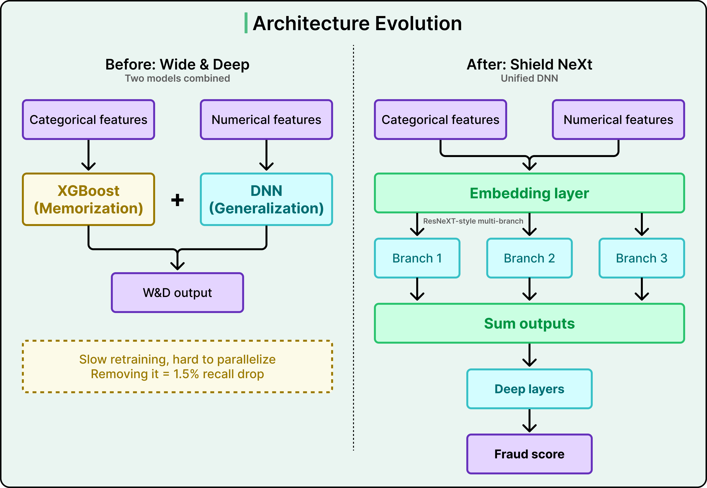
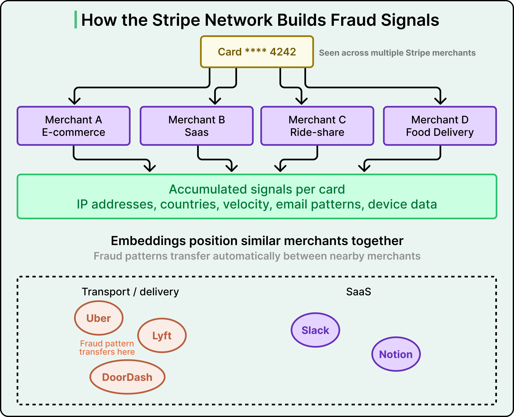
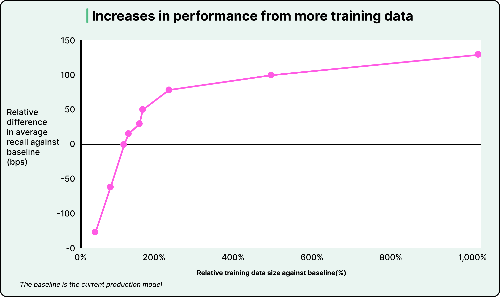
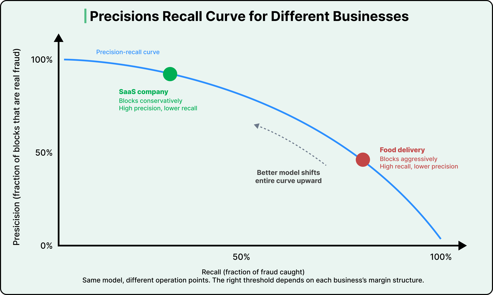
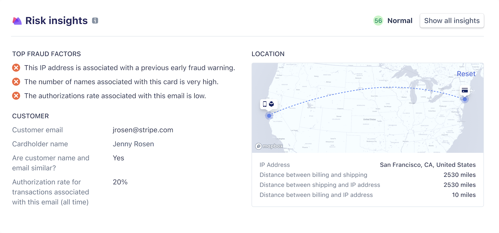

# Stripe Radar: Real-Time Fraud Detection

## Key Takeaways

- Stripe's Radar evaluates 1,000+ signals per transaction in under 100ms at 99.9% accuracy, powered by cross-merchant network visibility (90% of cards seen more than once across merchants)
- The architecture evolved from a Wide & Deep ensemble (XGBoost + DNN) to Shield NeXt, a unified multi-branch DNN inspired by ResNeXt that cut training time by 85%
- Learned embeddings for categorical data (merchant, bank, country) enable automatic geographic transfer of fraud knowledge without retraining
- Merchants tune their own precision-recall tradeoff based on margin structure -- high-margin SaaS blocks conservatively while thin-margin delivery blocks aggressively
- Continuous model drift management is critical: retraining on fresher data improves recall by up to 0.5% monthly as fraud patterns evolve toward high-velocity card testing attacks

## Architecture Evolution

Stripe moved from simple logistic regression to a "Wide & Deep" ensemble combining XGBoost (memorization of specific patterns) with deep neural networks (generalization to unseen patterns). However, XGBoost created operational bottlenecks: slow retraining, incompatibility with transfer learning, and limited experimentation velocity.

**Shield NeXt** replaces the ensemble with a unified DNN using a "Network-in-Neuron" approach inspired by ResNeXt. Multiple distinct computational branches process inputs independently, and their outputs are summed. This reduced training time from overnight jobs to under two hours (85% reduction), enabling multiple experiments per day.

## Data Advantage: Cross-Merchant Network

Stripe's moat is network-wide visibility. A single card is observed across e-commerce, ride-share, SaaS, and food delivery merchants, accumulating signals like IP addresses, countries, velocity patterns, email patterns, and device data.

Training labels come automatically from cardholder disputes integrated into payment flows, eliminating the manual labeling that competitors require.

## Feature Engineering

The system uses hundreds of aggregated network-wide features:

- **Intuitive signals:** name-email matching, card velocity, geographic consistency
- **Surprising signals:** device local time vs. UTC differences, dark web activity patterns
- **Discovery process:** forensic review of past fraud cases + weekly dark web monitoring to identify new feature candidates

## Embeddings and Transfer Learning

Learned numerical representations for categorical data (merchant identity, issuing bank, country, day of week) position similar entities close together in embedding space. This enables geographic transfer: fraud patterns identified in Brazil automatically apply to US transactions without retraining.

## Training Data Scaling

More data consistently improves model performance, with diminishing but meaningful returns even at 10x the baseline training set size.

## Precision-Recall Tradeoff

Fraud systems face inherent tension between false negatives (fraud slipping through) and false positives (legitimate customers blocked). 33% of consumers say they would stop shopping at a business after a single false decline.

Merchants adjust risk thresholds based on business economics:

- **SaaS (high margin):** blocks conservatively -- high precision, lower recall
- **Food delivery (thin margin):** blocks aggressively -- high recall, lower precision
- A better model shifts the entire curve upward, improving both metrics simultaneously

## Explainability: Risk Insights

The Risk Insights feature displays top fraud signals, location maps showing address/IP distances, and customer metadata. This enables merchants to understand decline reasoning, create custom rules, and improve their data submission.

Elasticsearch surfaces related transactions for broader context across the network.

## Production Challenges

- **Real-time feature computation:** maintaining updated state on every card in the network for sub-100ms scoring
- **Per-merchant impact analysis:** model improvements must not spike false positives for smaller businesses
- **Counterfactual analysis:** estimating outcomes for blocked transactions where the true result is unknown
- **Model drift:** fraud patterns continuously evolve; automated training, tuning, and evaluation tools tripled model release cadence

---

**Source:** https://blog.bytebytego.com/p/how-stripe-detects-fraudulent-transactions
**Date:** 2026-05-28
**Tags:** fraud-detection, stripe, machine-learning, real-time-systems, neural-networks, embeddings, precision-recall
