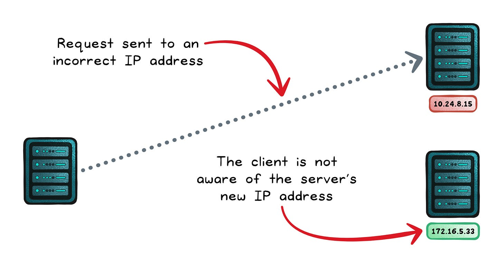
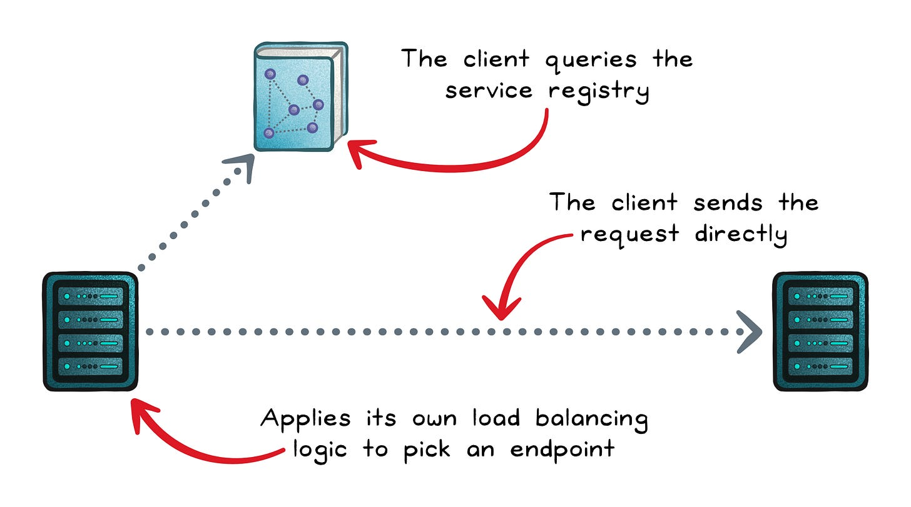
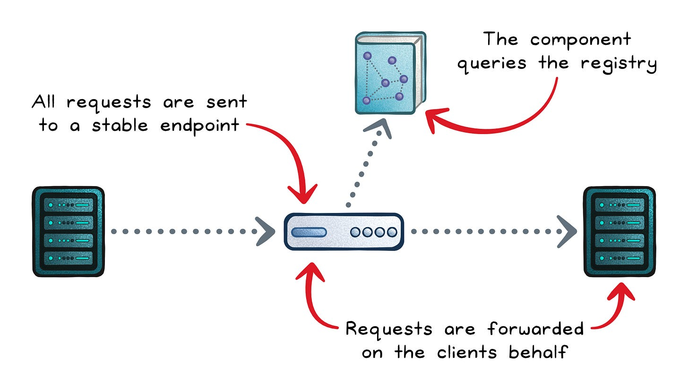
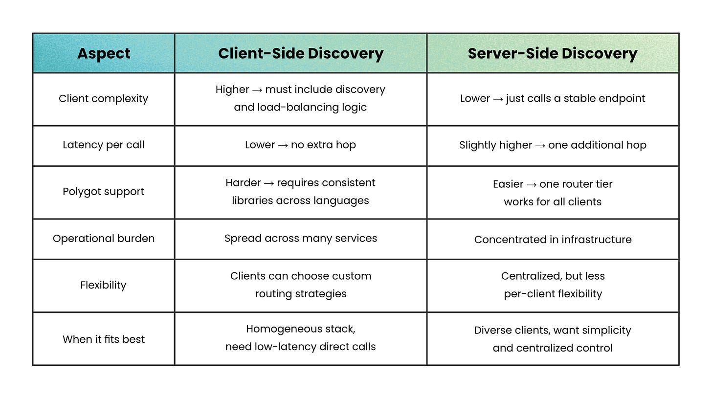

# Service Discovery

## Key Takeaways

- Service discovery replaces hard-coded addresses with a live registry that resolves service names to healthy endpoints at runtime
- Two primary patterns: client-side (client queries registry directly, lower latency) vs. server-side (intermediary handles lookup, simpler clients)
- Client-side suits homogeneous stacks needing low-latency direct calls; server-side suits diverse clients wanting centralized control
- Enables dynamic scaling, fault tolerance, load distribution, and location transparency without manual updates

## The Problem

In distributed systems, services constantly appear, disappear, and relocate. Hard-coded addresses break when instances move.

## Client-Side Discovery

Client queries the registry directly, selects an endpoint, and sends the request with no intermediary.

- Client embeds discovery + load-balancing logic
- No extra network hop — lowest latency
- Requires consistent libraries across all languages in the stack
- Operational burden spread across services
- **Best for:** homogeneous stacks, low-latency requirements, teams that can standardize on shared libraries

## Server-Side Discovery

Client calls a stable intermediary (load balancer / gateway) which handles registry lookups and routing.

- Client code stays simple — just calls a stable endpoint
- One additional network hop
- One router tier works for all client languages
- Operational burden concentrated in infrastructure
- **Best for:** diverse client types, polyglot environments, centralized policy enforcement

## Comparison

| Aspect | Client-Side | Server-Side |
|---|---|---|
| Client complexity | Higher — includes discovery + LB logic | Lower — calls stable endpoint |
| Latency | Lower — no extra hop | Slightly higher — one additional hop |
| Polyglot support | Harder — consistent libs across languages | Easier — one router for all |
| Operational burden | Spread across services | Concentrated in infra |
| Flexibility | Custom routing per client | Centralized, less per-client control |

---

**Source:** https://blog.levelupcoding.com/p/service-discovery-in-distributed-systems
**Date:** 2026-05-24
**Tags:** service-discovery, system-design, distributed-systems, microservices, load-balancing
