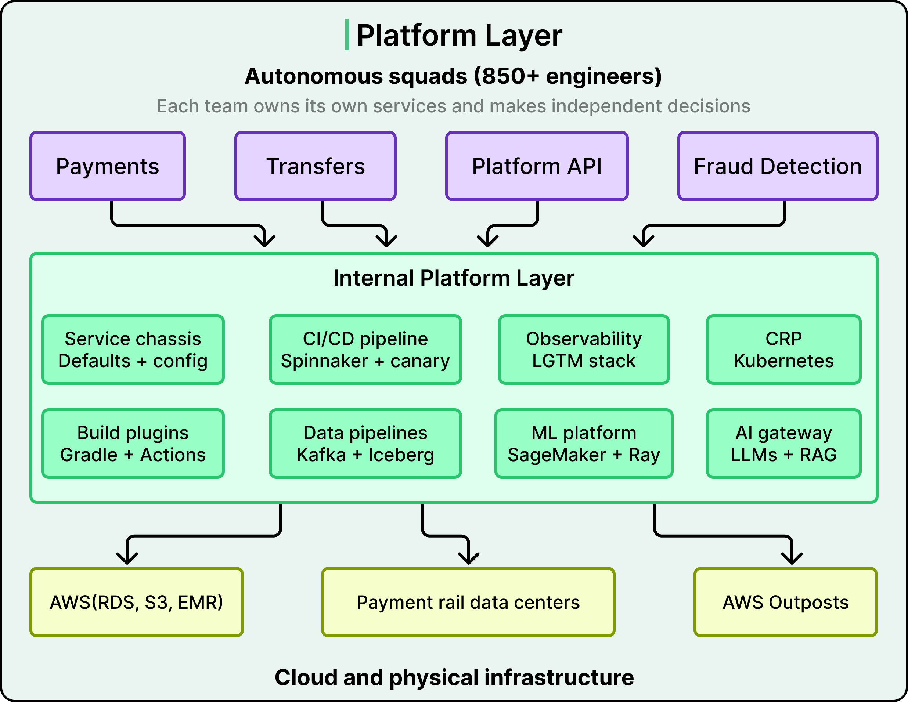
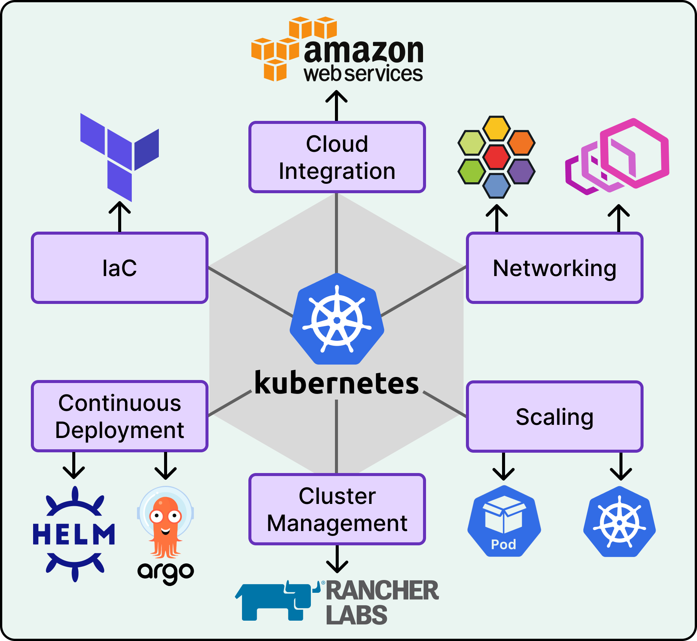
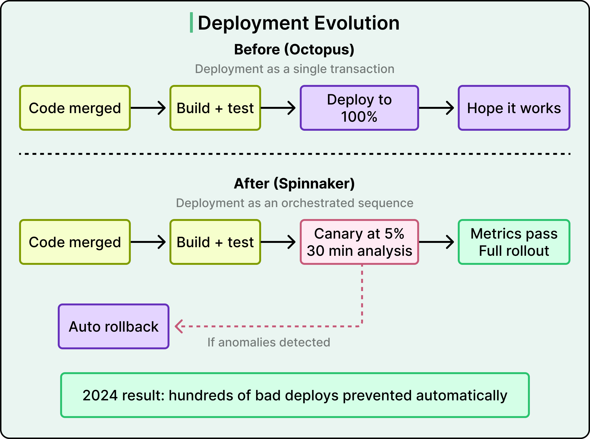
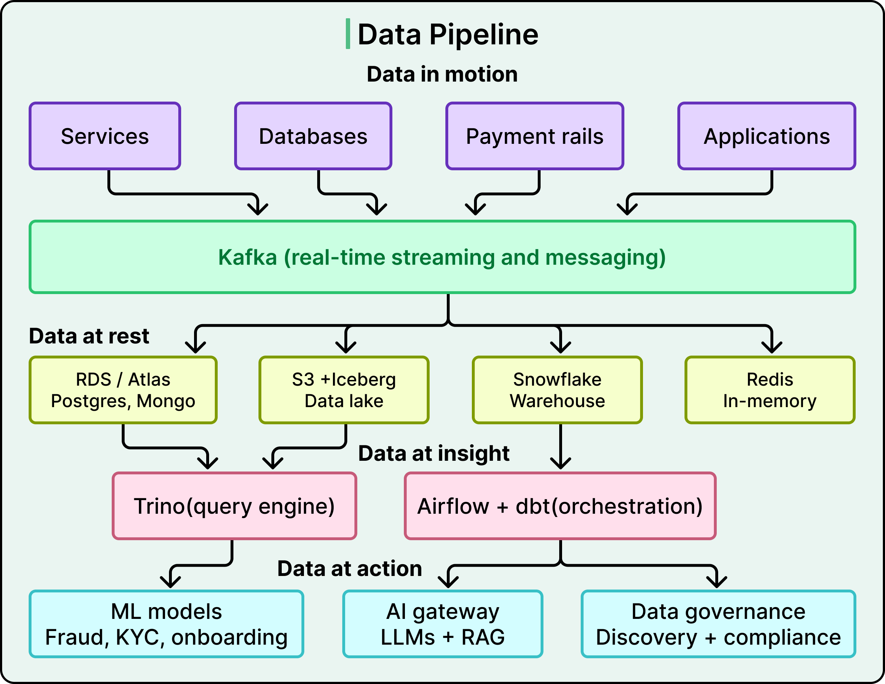
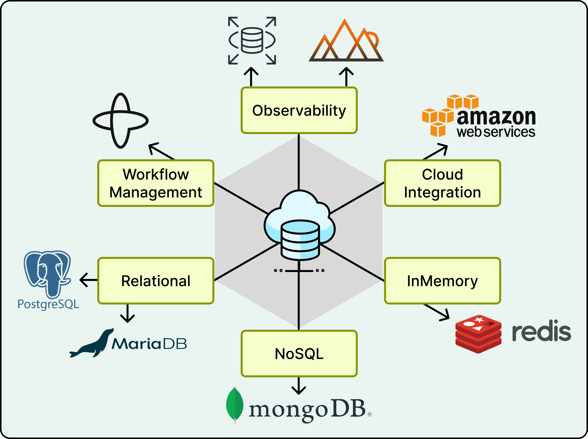
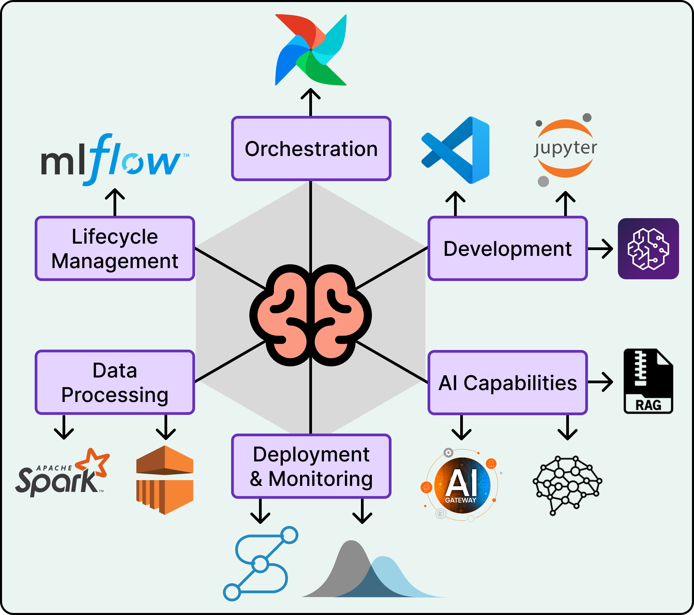
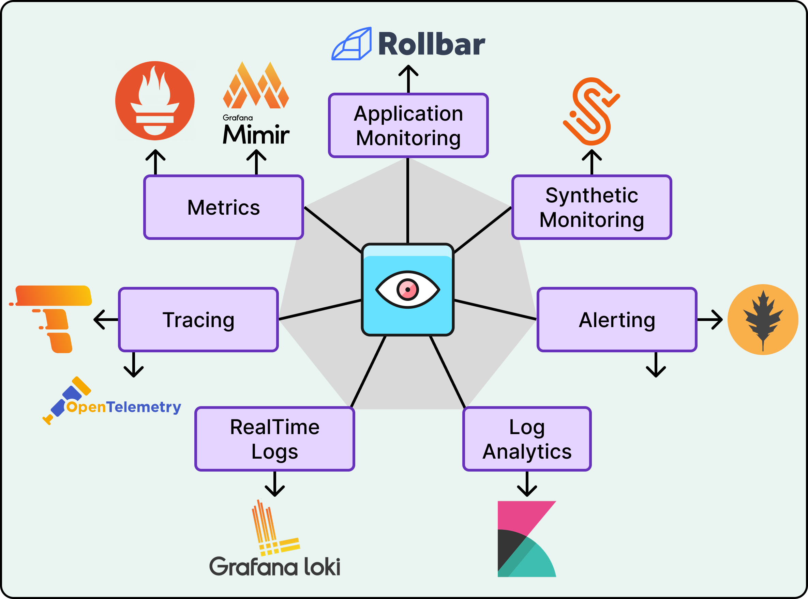

# Wise Tech Stack

## Key Takeaways

- Wise treats internal infrastructure as a product serving 850+ engineers — standardized platforms absorb complexity while 850+ autonomous squads retain decision-making independence
- Microservice chassis pattern (versioned artifact, not templates) lets security/observability/Kafka updates flow downstream with a version bump across 1,000+ services and 700+ Java repos
- Canary deployments route 5% traffic to new versions, analyze technical + business metrics for 30 minutes, auto-rollback on anomalies — prevented hundreds of bad deploys in 2024
- Data architecture follows a clean layering: data in motion (Kafka) → data at rest (RDS, Iceberg, Snowflake, Redis) → data at insight (Trino, Airflow/dbt) → data at action (ML models, AI gateway)

## Platform Architecture

**Scale:** £36B quarterly cross-border transfers, 65% instant, 1,000+ microservices, 40 web apps, native mobile apps.

**Internal platform layer:** service chassis, CI/CD (Spinnaker + canary), observability (LGTM stack), CRP (Kubernetes), data pipelines (Kafka + Iceberg), ML platform (SageMaker + Ray), AI gateway (LLMs + RAG).

**Infrastructure:** AWS (RDS, S3, EMR) + physical payment rail data centers (UK, Hungary, Australia) + AWS Outposts for consistent tooling.

## Compute & Deployment

- **CRP:** ground-up K8s rebuild — Terraform provisioning, RKE2 bootstrapping, Rancher state management, Helm (replaced JSONNET), ArgoCD with custom plugins; scaled from 6 to 20+ clusters
- **Canary:** 5% traffic → 30-min analysis of error rates, latency, transaction success, conversion → auto-rollback on anomalies
- **CI/CD:** GitHub Actions (migrated from CircleCI), Gradle plugins standardizing builds, SLSA framework as a single plugin update; 500K monthly builds, 1,000+ hours saved via container caching
- **Mobile:** iOS migrated to Tuist + SPM (builds: 28s → 2s); Android on full Jetpack Compose + Kotlin 2.x; BFF services share logic across platforms

## Data Architecture

| Layer | Components |
|---|---|
| Data in motion | Kafka (async messaging, log collection, streaming analytics) |
| Data at rest | RDS (Postgres, MariaDB), MongoDB Atlas, S3 + Apache Iceberg data lake, Redis, Snowflake |
| Data at insight | Trino (federated queries across Iceberg/Snowflake/Kafka), Airflow + dbt-core |
| Data at action | ML models (fraud, KYC, onboarding), AI gateway (LLMs + RAG), data governance |

- Data Archives service manages 100B+ records across multiple databases
- In-house data movement service channels Kafka/databases → Snowflake, S3 Parquet, Iceberg

## ML & AI

- **Development:** SageMaker Studio, Spark on EMR, Airflow orchestration
- **Features:** SageMaker Feature Store syncing hundreds of features for training + inference
- **Tracking:** MLflow for experiments, metrics, model versions
- **Serving:** in-house prediction service on Ray Serve; automated data drift detection
- **AI gateway:** secure multi-provider access (Anthropic Claude, AWS Bedrock, Google Gemini, OpenAI); Python library inspired by LangChain; custom RAG service for doc summarization + customer service

## Observability

**LGTM stack (Grafana):** Loki (logs), Grafana (dashboards), Tempo (tracing), Mimir (metrics — migrated from Thanos).

- 6M samples/sec ingestion, 150M active series for largest tenant
- Integrated correlation linking error logs ↔ traces ↔ metric spikes
- Dedicated observability clusters separated from production
- Grafana Pyroscope pilot for service profiling
- Temporal workflow engine for database switchovers and recovery tests

---

**Source:** https://blog.bytebytego.com/p/the-tech-stack-powering-wise
**Date:** 2026-05-28
**Tags:** wise, tech-stack, microservices, kubernetes, kafka, canary-deployment, observability, grafana, ml-platform, fintech
